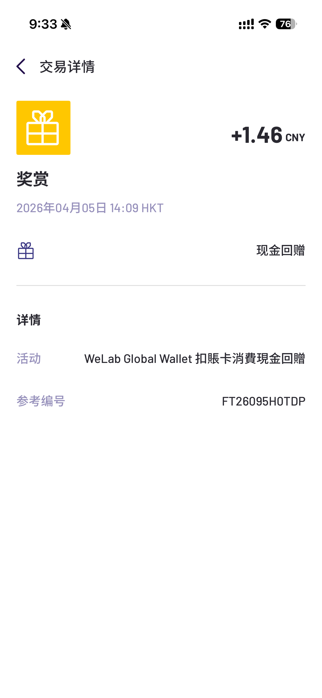
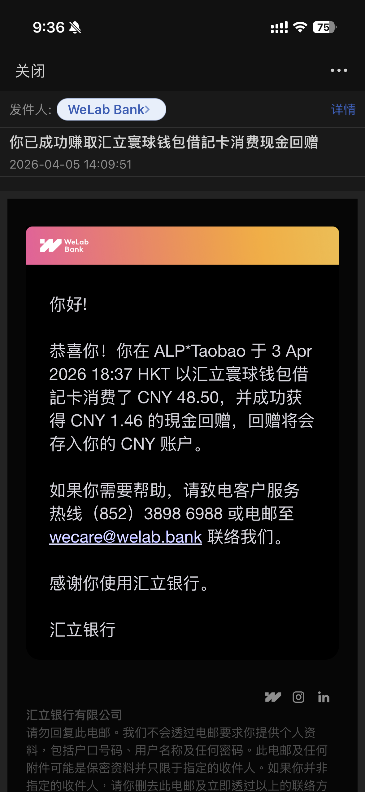

## 汇立寰球钱包借记卡持卡人专享

香港汇立银行 WeLab 这次给 **汇立寰球钱包借记卡** 持卡人放了一个比较直接的返现活动。

### 优惠期

**2026 年 4 月 1 日至 2026 年 5 月 10 日**（包括首尾两日）

### 优惠详情

由 **2026 年 4 月 1 日至 2026 年 5 月 10 日**，合资格持卡人以 **汇立寰球钱包借记卡** 进行合资格消费交易，可享：

- **本地消费高达 0.2% 现金回赠**
- **海外消费高达 3% 现金回赠**

现金回赠将于 **2026 年 5 月 31 日或之前** 自动存入核心账户。

每笔合资格消费交易可获的回赠上限为 **HKD 50** 或其等值。

## 到账实测

我这边也有一笔实际到账记录可以给大家参考。

根据截图，**2026 年 4 月 3 日**在 `ALP*Taobao` 消费 **CNY 48.50**，随后在 **2026 年 4 月 5 日 14:09 HKT** 收到 **CNY 1.46** 的现金回赠。

从这笔交易来看，返现比例大约就是 **3%**，和这次活动里“海外消费 3% 返现”的口径是对得上的。邮件通知里也写明了，这笔奖励对应的是 **WeLab Global Wallet 扣账卡消费现金回赠**。

## 怎么参与

如果你还没开通 WeLab，可以先看我之前写的开户攻略：

👉 [香港汇立银行（WeLab）开户和奖励介绍](https://www.laosji.net/p/welab-bank/)

注册时记得填写邀请码：`LAOSJI`

## 最后提醒

这篇主要是整理这次活动信息，再补一笔**真实到账截图**做验证。最终哪些交易算本地消费、哪些交易算海外消费、返现是否受其他条款限制，还是要以 WeLab App 里的活动页和官方条款为准。

如果你已经持有这张卡，最近刚好有海外签账需求，可以留意下这波活动；如果还没开户，也可以先把 WeLab 账户开起来，邀请码还是：`LAOSJI`。
