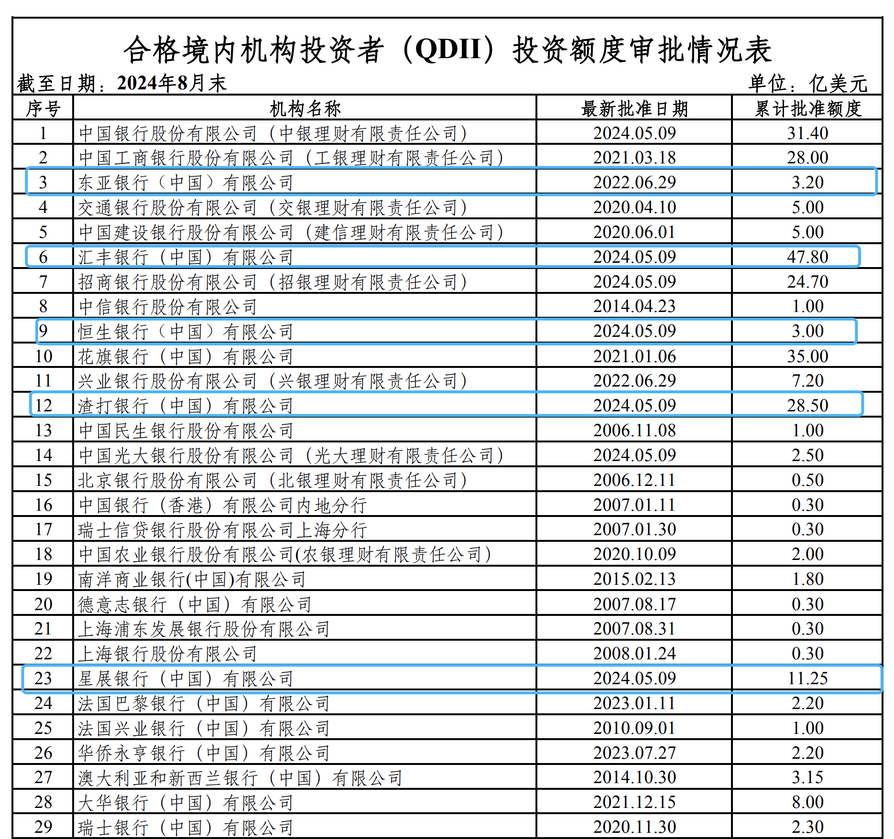

今天又用了一下段总的昵称，因为这是最早大家知道我的名字，今天的分享也会带大家回顾我今年的一些经历。上午我正在准备分享内容的时候，突然接到渣打银行我自己的客户经理的电话，就还挺突然的，一边接起了电话，一边脑子飞速在想这是发生什么事了。然后，客户经理还挺直接的和我说我买的结构性存款敲出了，明天就能到账（开心），希望我继续留在渣打银行。听到这里本来一颗悬着的心，立刻开心到飞起了。我就说其他银行的朋友也在找我（确实其他银行的朋友早都提出要求了，都要照顾到嘛），我在考虑去哪个银行。这时候电话里传来了一个男人的声音，说他是渣打的理财经理，刚才我说的话他都听见了，他们最近推出了新产品让我了解一下，接着说了很多美国大选和明年的降息等。听完之后，我说发资料给我先看看吧。挂了电话，仍然是有点抑制不住的小开心，本来我买的产品是明年3月份才能到期，没想到挂钩的美股Apple和Meta太争气了，居然给我涨到敲出了。年底了，就算是发个年终奖吧。说到这里顺便提一下，估计国内有很多公司今年的年终奖都会泡汤，这就是在这个高度不确定的时代，每个职场人面临的风险。我之前还公司上班的时候，也没接触过理财，总觉得一年到头钱放在自己银行账户存款里是最有安全感的。但是，在今年做了一些小规模的个人理财试验之后，我觉得让自己的资产能为自己赚钱，一年到头能获得额外的收入，这才是让我最有安全感的事。最早关注我的朋友们，应该都注意到了，我是在今年3月份开了渣打的账户，也就是从那个时候起，对理财这件事的热情一发不可收拾，一直分享到现在。还有另外一件让我很高兴的事，在我做了几期油管视频后，油管的浏览量、评论还有粉丝也开始有了量变。对于理财这件事情，我一直坚持的态度就是只分享自己的真实体验和感受，跟喝酒一样从来不劝。今天我会分享我自己在年底会做的几件事情，希望可以对需要的朋友有帮助。

# 第一、兑换美金
我们都知道个人年度便利化购汇额度在年底不使用，当过了元旦那天就会重新计算，去年的额度就算是浪费了。所以，在年底之前我会去准备换一些美金，把当年的额度用掉。在购汇之前，还要去各大银行的手机银行上看看对比一下汇率，然后选择汇率最好的银行兑换。去年就是因为懒，没有去比较汇率，直接在银行开户的时候换的美金，直接亏几千块人民币。踩了一会肯之后，以后宁可多对比一下汇率，就跟大家做定期存款一样，多找几家银行，干嘛要跟钱过不去呢。

# 第二、找QDII
在年底很多银行都会推出新的QDII产品，所以要跟自己的银行客户经理多聊一下，问问有什么新产品可以推荐。QDII之前也分享过，简单再解释一下QDII就是我们普通人可以通过合格境内机构投资者去投资境外产品，比如说固定收益产品、基金、股票、信托、衍生工具等。对持有美金的朋友来说，找一个保本型的QDII产品理论上是比美金定存更好的选择，因为美金定存存在着汇率差的风险，如果你定存收益低于汇率损失，那说明你持有的美金资产亏损的，不仅没有跑赢通胀，还出现了亏损。我知道现在很多朋友大都持有美元资产，我就不会把所有美元都做定存，分散投资对冲风险永远是第一选择。我自己的配置是一部分放在高利率的定存中，一部分做结构性存款，在做一些股票的配置。当然据我所知有很多朋友是不懂投资股票的，甚至不知道怎么去投资股票，结构性产品就是一个很好的的选择，可选择不同的挂钩标的物，通过挂钩标的间接投资到股票、基金等产产品也是一个很不错的选择。我今年3月份在渣打购买结构性产品的时候，那个时候客户经理推荐给我的一些产品都已经售罄了，因为QDII的额度每家银行也有额度限制，老客户都会在元旦之后开始抢购，这就导致很多银行的额度在1-2月份大量消耗，很多时候一般的客户银行都不愿给你额度，都留着给大客户用，所以，有需要的朋友可以抓紧冲了。（希望银行看到不要骂我对他们的揭秘），有需要预约客户经理的朋友，直接私聊我，各大银行都有专门的对接人，一对一服务。
附上国家外汇管理局公布的每家银行QDII的额度。

# 第三、搬砖
这个不能说太细太明白，只可意会不能言传，大家都懂就可以啦。有境外账户的，可以搬一些砖出来，通过券商平台投资全球市场，感兴趣的朋友可以私聊我。
最后，肯定有朋友对我的结构性产品的收益很感兴趣，特别想知道到底是多少就敲出了呢？在这里也不隐瞒大家了，收益是7%，目前来说还是比较理想的。我个人觉得99%都是运气，仅供参考，谨慎模仿。后来，我的客户经理又来问我，现在做自媒体赚钱吗？我只回复了三个字看内容，其实在每个行业中，不论大环境好坏都有人在低调赚钱，也总有人在高喊为生存而战。只要用真心去对待你所热爱的事，我想运气不会太差。今天本来给大家分享的不是这个内容，在我挂了电话后就写了今天的这个分享，我想这里不仅是经济上小小的收获，相信大家也看到了我个人今年的一些成长。感谢你们的相伴，分享是我最好的学习方式，如果有幸让看我内容的你，今年也有收获，请你们用点赞+评论的方式告诉我“今年你们都有了更多收入”。


