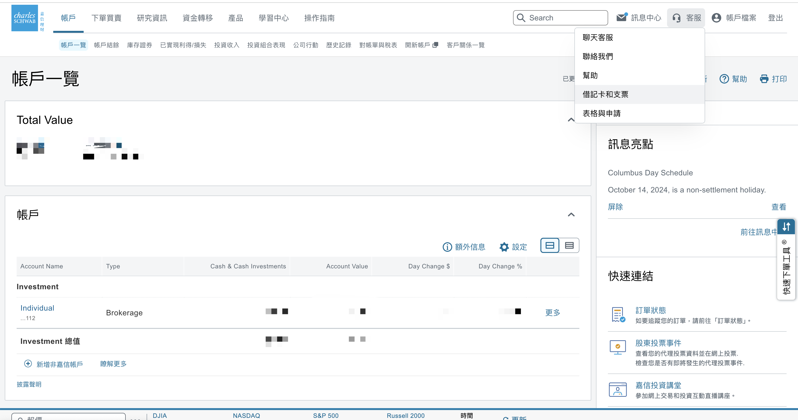
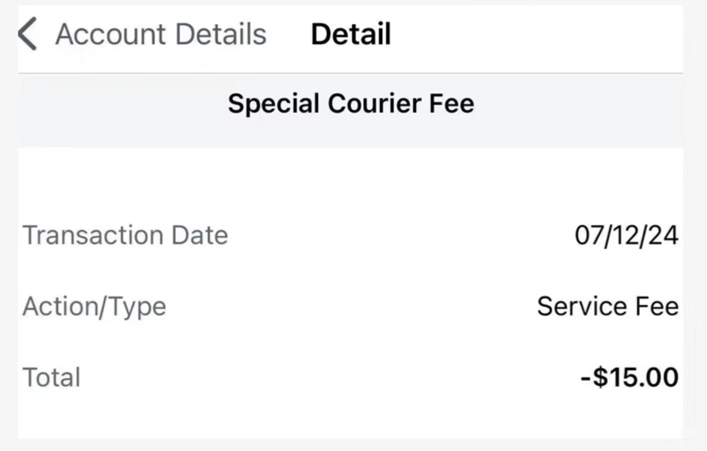

上周和大家分享了第一证券和美国汇丰银行卡的申请攻略，就有很多用户来咨询嘉信理财借记卡是不是不能申请了？确实嘉信理财从2023年8暂停了中国内地、香港以及台湾用户申请借记卡。不过，今年还是有很多朋友通过搬砖使用钞能力，申请到了嘉信理财的借记卡。这张卡被誉为旅行神卡，全球范围内所有ATM提款免手续费，并且使用嘉信理财股票和美国国债交易0佣金。

# 为什么开嘉信理财借记卡？

1. 全球任何一家ATM取钱都免手续费！有的银行ATM会收取一定手续费，一点也不用担心， 因为Charles Schwab 会在月末时给报销掉这部分费用，只要你敢用，嘉信就敢报销。
2. 账户存的是美元，在ATM取款时取出的是当地货币，自动会按照当天汇率计算，比银行良心多了！
3. $0 月费，没有最低存款要求。
4. $0 incoming wire transfer fee，适合接从国内打过来的汇款。
5. 嘉信理财发的借记卡是 Visa 卡，几乎全世界的ATM都可以刷。

# 缺点

每天最多只能取现1000美金，和第一证券一样，证券公司一般都是这样的要求，以防止用户把他们当成羊毛取现工具。

# 开户要求

1. 已经有嘉信的brokerage account；
2. 不仅账户里要有钱，最好还持有股票或ETF。（建议申请时账户余额不要低于5000美金，很多人都是2.5申请到的）

# 申请步骤

1. 首先开通嘉信理财证券账户，开户全套中国资料是没有问题的，在国内就能开。[之前写过攻略，大家可以参考](https://mp.weixin.qq.com/s?__biz=MjM5MTM0NTgxNQ==&mid=2648636151&idx=1&sn=2e1a7f7e33eb6f61273e83797bd3da42&chksm=be9ca70f89eb2e194a4e2fa6f23aa2da75f368c5ff98ed89ae940bed32e9b3a4cd8dab677fd2&scene=21#wechat_redirect)。申请链接：<https://www.schwab.com/client-referral?refrid=REFERCHPQ83NZ，这个链接可以拿到奖励，存入2.5万美金可以拿到100美金奖励，建议大家可以先拿奖励，然后再申请借记卡。>

1. 登录嘉信理财网页版，右上角找到客服，选择借记卡和支票，填好表提交后联系客服告诉他你需要申请一张借记卡。然后填表，填好提交后。打电话找人工客服，国内可打免费400电话：4001206217，找中文客服。根据经验，如果你资产没达标，那就是没废话直接秒拒，如果资产达标，会和经理申请balabala，后续就等下卡吧。如果资产达标2.5万美金以上，还以“国内不能办”秒拒的，你就说找他们主管或者重新打换个客服。记得在申请之前一定要让自己先成为有价值的用户，否则别浪费时间和感情了。

 # 审核通过快递到国内地址

快递回国，费用15美金。

这张卡虽然是VISA卡，但扣的是你嘉信理财账户里的钱，本质上是借记卡。下卡后你的账户里可以不用一直保持2.5万美金，至少放1000维持账户不关即可，嘉信的风控相比银行来说小很多，有的时候跟客服商量商量都好说。另外，据说英国地址可以1美元就下卡，大家可以用ifast和wise英区的账单做地址证明，进行开户，如果只是为了拿卡的话，长期用还是建议真实地址比较可靠。
