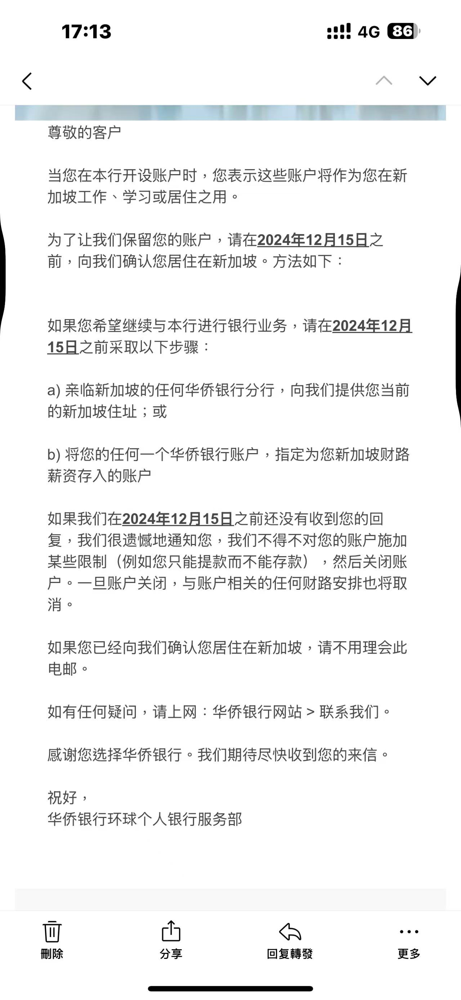
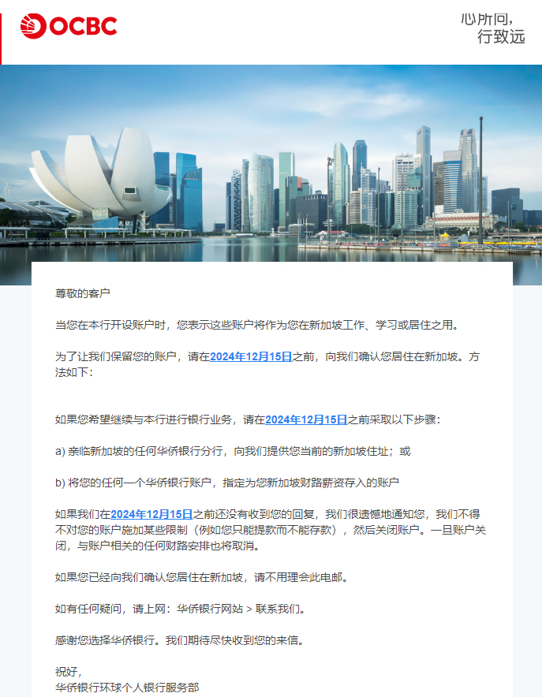
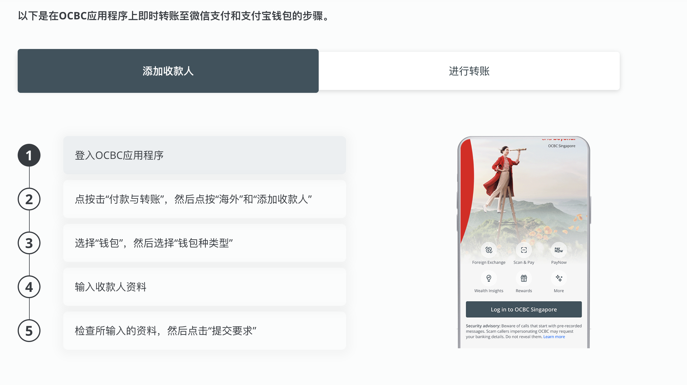
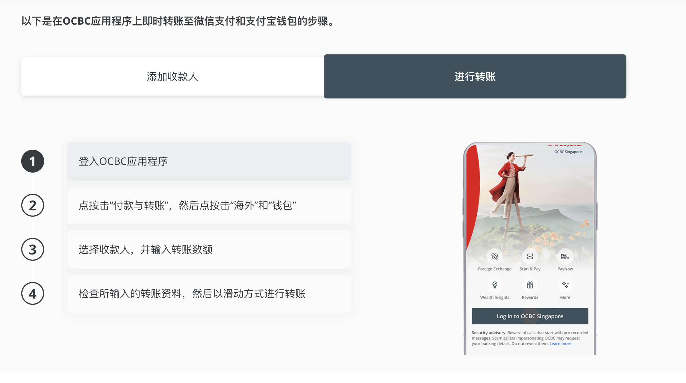
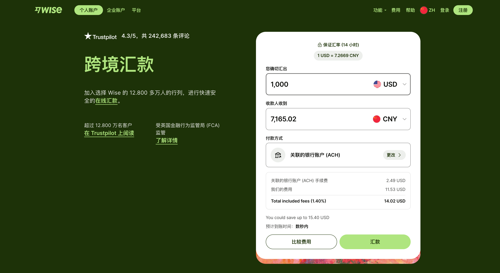

昨天大批新加坡OCBC用户都收到了新加坡ocbc的关户通知，不过大家也不必慌张，关户只是需要在规定时间内把账户余额转出就可以了，现在收到通知的用户会先限制你账户只能转出不能收款。这次关户是自从上个月禁止境外用户开户的政策升级。由于上次禁止新加坡境外用户在线注册之后，有很多人还是通过修改银行结单地址的方式在申请开通新加坡ocbc账户，使用虚假地址注册开户的朋友这几天就要哭了。今天来给大家分享一下被ocbc关户之后账户该怎么办？为大家提供了3种方案，肯定有一种适合你。

前两天我还看到网上有人炫耀自己新开的ocbc账户，这几天都在哭着分享自己的关户通知了。根据新加坡ocbc最新的开户政策，开设账户是作为在新加坡工作、学习或居住之用。在线注册账户现在有两种方法来保留自己的账户：a)亲临新加坡的任何华侨银行分行，提供你当前的新加坡住址；或b)将您的任何一个华侨银行账户，指定为您新加坡财路薪资存入的账户。现在这个门槛相当高了，就算你去了新加坡拿不出可靠的地址证明，那也没法开户。根据大家的反馈，不论是老用户还是新开的用户都要求在12月15日提供相关证明，否则就会先限制使用，等你钱拿出去就关停账户。估计在12月15日之后，ocbc的开户流程会进行修改，比如开户会要求GPS定位在新加坡之类的。

如果你的ocbc账户有钱，收得到关户通知不必慌张，毕竟国外的银行不会吞了你的钱，关户都是会通知你在某个时间节点之前让你把钱转走。除了银行怕脏之外，对客户诚信才是最重要的，没有哪个为了你的三瓜两枣把自己的名声做臭。下面为大家分享一下，被ocbc关户之后账户有哪些解决方案。

# 解决方案

## 方案一：新币回国

### 微信/支付宝

「优势」：免手续费

「缺点」：汇率不好

新加坡ocbc支持直接转账到微信和支付宝，借助Visa Direct即时转账功能，这个也是亚太区首个能与微信支付和支付宝进行即时点对点转账的手机银行应用程序。

**转账方法：**

打开OCBC应用程序，选取“微信支付”或“支付宝”，添加收款人并于12小时后显示于收款人名单，既可输入收款人的手机号码和姓名，享有即时转账服务。只限于在微信支付或支付宝上以中国大陆居民身份证和手机号码实名注册的中国用户进行转账服务。

### 熊猫

熊猫速汇，相信很多朋友都用过了。优势就是速度快，手续费低，每笔只要10SGD，单笔100-6000新币。通过我的合作链接注册，首汇免手续费。

[https://p.pandaremit.com/h5ditui/launchIndex?invtCode=11250236&area=SGP&type=dituihttps://p.pandaremit.com/h5ditui/launchIndex?invtCode=11250236&area=SGP&type=ditui](https://p.pandaremit.com/h5ditui/launchIndex?invtCode=11250236&area=SGP&type=ditui)

## wise

wise现在用大陆身份和地址就能注册，但是得有护照。使用wise汇款回国到的优势就是比OCBC直接转微信和支付宝的汇率高。

「缺点」是会收取手续费，以 SGD 汇款至 CNY，需要支付固定费用 6.11 SGD + 兑换金额的 0.62%。

还有就是可以通过wise转账到ifast（免手续费），ifast是一个多币种的账户，可以享受**3.10%新币定存**利率。后续想要提取资金可以ifast转wise再转港卡。

## 方案二：去香港开户

可先把ocbc账户的资金先放到券商，比如老虎、盈立、moomoo，新加坡长桥等，都是免手续费的。等开好了港卡或者其他境外账户，再提现出来。老虎的优势就是新币和港币出入都免手续费，有需要的朋友加微信。

去香港开户我们有免费的带团服务，大家有想参加的私聊我，拉你进群成团。另外，还有预约免排队的VIP付费开户服务。

还有去香港不可错过的福利，Welab银行迎新现金好礼记得领，就算是补偿你去香港的开支了。Welab邀请码：LAOSJI，注册就可以领取100HKD现金奖励，活动截止日期2025年1月15.

## 方案三：远程见证开通香港/新加坡账户

渣打、汇丰和东亚银行，内地开户要求存款50万，就能一次性远程见证开通香港和新加坡账户，2-4周内拿到卡。

星展银行新加坡最大的银行，内地开户要求存款100万以上，就能一次性远程见证开通香港和新加坡账户，2-4周内拿到卡。

大华银行新加坡三大行之一，内地开户要求存款100万以上，再加上一个第三国的有效签证就可以远程见证开户。

需要远程见证开户的朋友，加微信帮你推荐专属客户经理对接。

[查看全文，请移步我的微信公众号，一步直达](https://mp.weixin.qq.com/s/R2fIODc14WauLDIe2fLPUA)