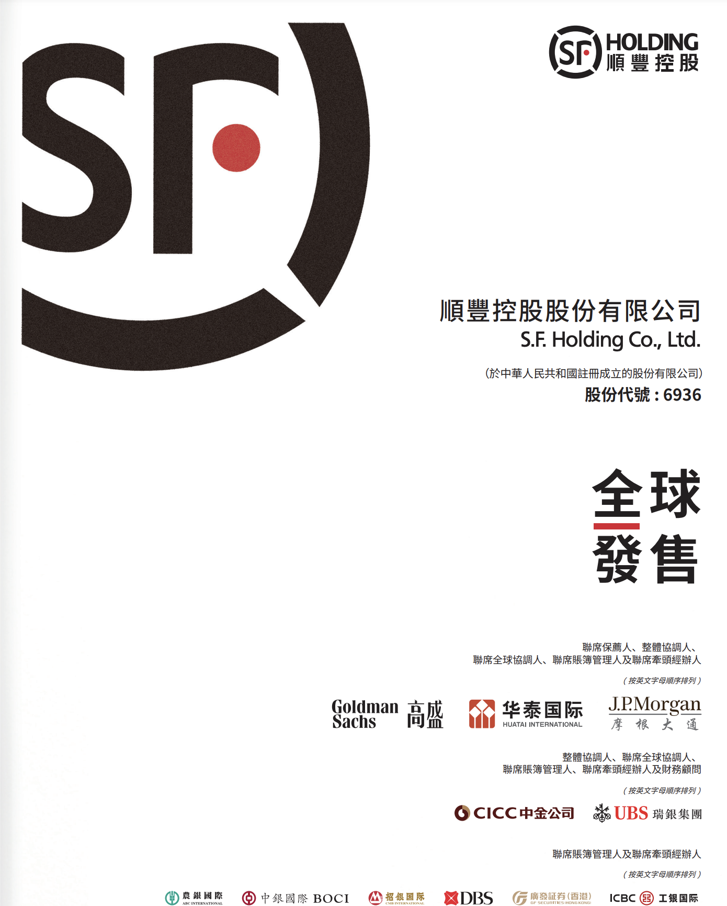
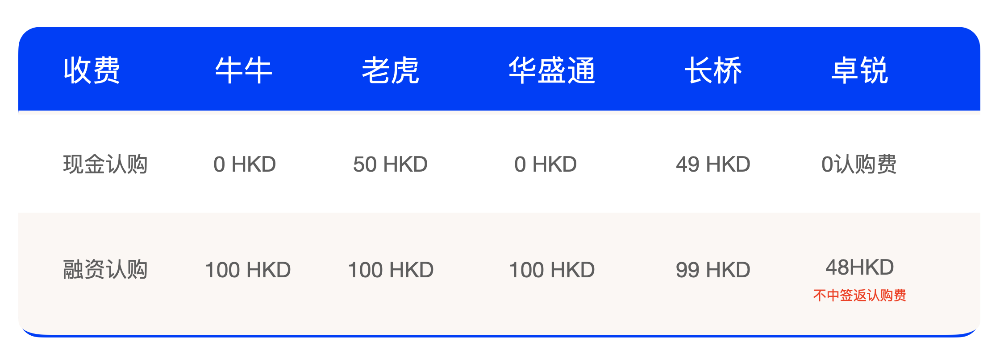
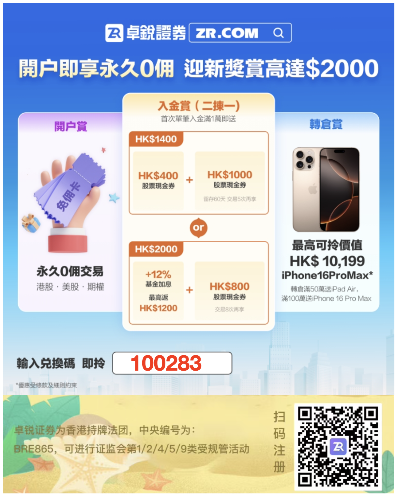
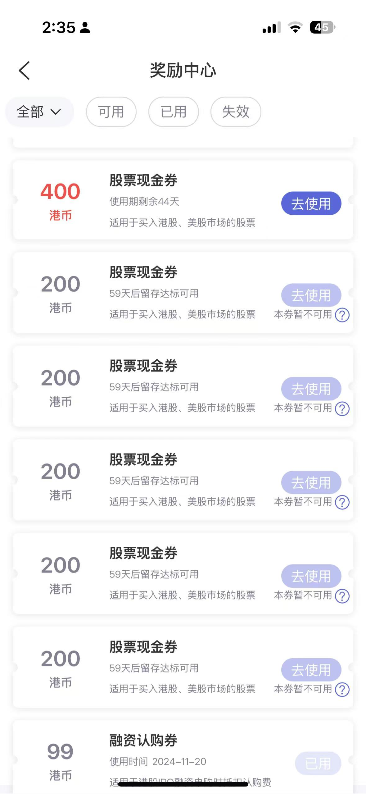
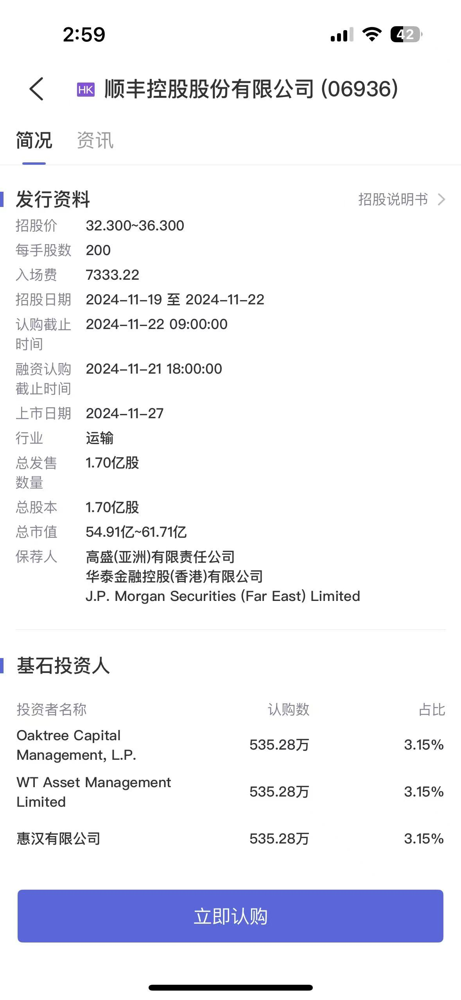

11月19日上午，[顺丰控股](http://quote.eastmoney.com/unify/r/116.06936)（002352.SZ，股价42.32元，市值2038.21亿元）在港交所发布了招股说明书，股票代码：06936。顺丰拟全球发售1.70亿股股份，招股价介于32.3港元至36.3港元，总市值1611亿～1810亿HKD，公开认购在11月22日截止，11月25日公布中签，11月27日正式公开发售。

# 募资用途

一是用于加强公司的国际及跨境物流能力；二是用于提升及优化公司在中国的物流网络及服务；三是用于研发先进技术及数字化解决方案，升级公司的供应链和物流服务及实施ESG相关举措；四是用作营运资金及一般企业用途。

# 发展历程

- 2017年1月**顺丰控股**(002352.SZ)，借壳鼎泰新材在深交所上市，并在当年2月完成更改为现名。
- 2018年10月26日，顺丰速运透过顺丰香港与德国邮政敦豪集团（DPDHL）达成战略合作，收购DHL旗下的敦豪供应链香港及敦豪供应链北京，即DHL中国内地、香港及澳门供应链业务。
- 2021年，顺丰控股宣布斥资175.6亿元收购[嘉里物流](https://zh.wikipedia.org/wiki/%E5%98%89%E9%87%8C%E7%89%A9%E6%B5%81)51.8%股权。
- 2022年顺丰进入《财富》世界500强、《财富》中国ESG影响力榜。
- 2023 年 8 月 21 日，公司向香港联交所递交了本次发行上市的申请。
- 2024 年 6 月 28 日，按照本次发行上市的时间安排并根据香港联交所的相关规定，公司更新递交了本次发行上市的申请。
- 2024 年 9 月 12 日，香港联交所上市委员会举行上市聆讯，审议了公司本次发行上市的申请。
- 2024 年 11 月 19 日，公司按照有关规定在香港联交所网站刊登并派发本次发行上市 H 股招股说明书。

# 投资者

此次顺丰控股引入的基石投资者，包含多家知名中外投资机构，比如橡树资本、惠汉、WT Asset Management、中国太保、小米旗下投资公司Green Better、Infini、Wind Sabre、摩根士丹利国际、Ghisallo、睿郡资产等。其中，橡树资本（Oaktree Capital）是投资大师霍华德·马克斯创立的公司，而睿郡资产是国内知名百亿级证券私募管理人。

# 联席保荐人

- 高盛亚洲有限责任公司
- 华泰金融控股香港有限公司
- J.P. Morgan Securities(Far East)Limited

# H股打新选哪家手续费最划算？

  卓锐证券迎新礼【港股·美股·期权永久0佣+年终大礼2000HKD+转仓iPhone16pro max奖】

专属注册链接：https://h5pro.zr66.com/zhuorui_web_h5/?channelId=100283

- 活动时间：2024.11.19-2024.12.31

💰注册送：4张融资认购券

💰开户送：港股·美股·期权永久0佣

**💰入金奖励二选一：**

- 方案A、首次入金1万HKD以上，奖励12% 基金加息券（最高返 HK$1,200）+800HKD现金券；
- 方案B、首次入金1万HKD以上，奖励1400HKD现金券；

💰转仓奖励（新老用户均可参与）：

首次转仓50万HKD以上，可获得iPad Air；

首次转仓100万HKD以上，可获得iPhone 16 Pro Max。

- **打新优惠**

现金打新：0认购费

融资打新：48港币/笔

融资利息：0息（目前额度上限500w）

融资打新不中返认购费，任意ipo认购成功再送10-1000元现金券