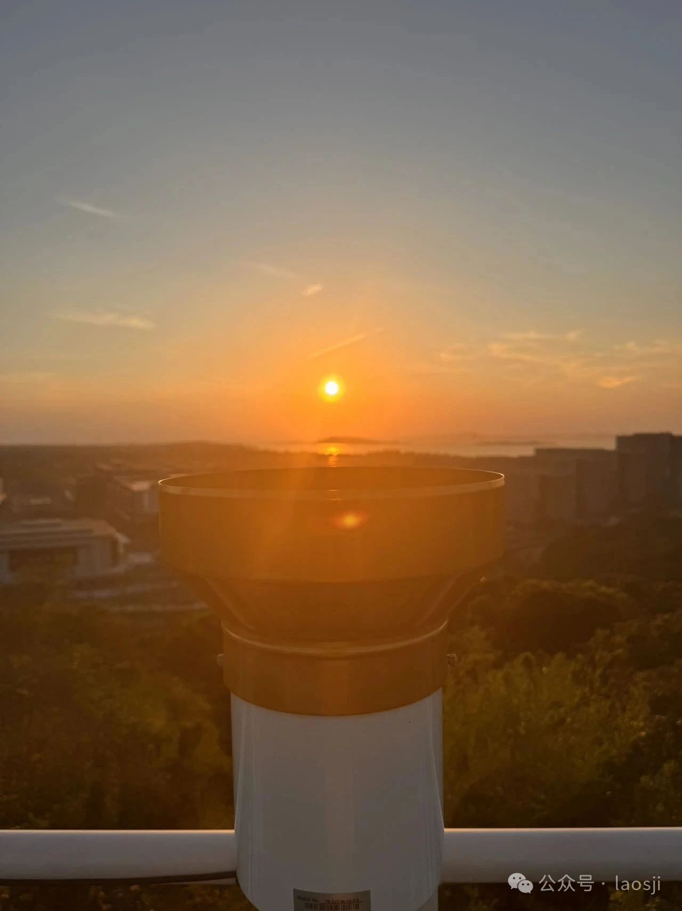
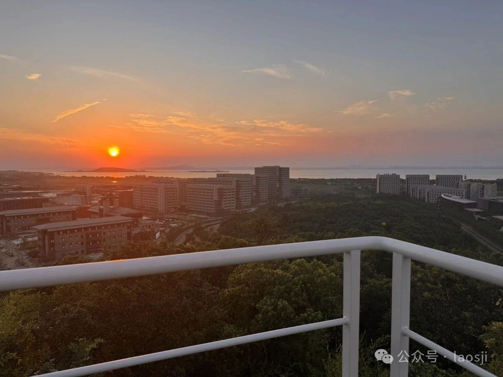
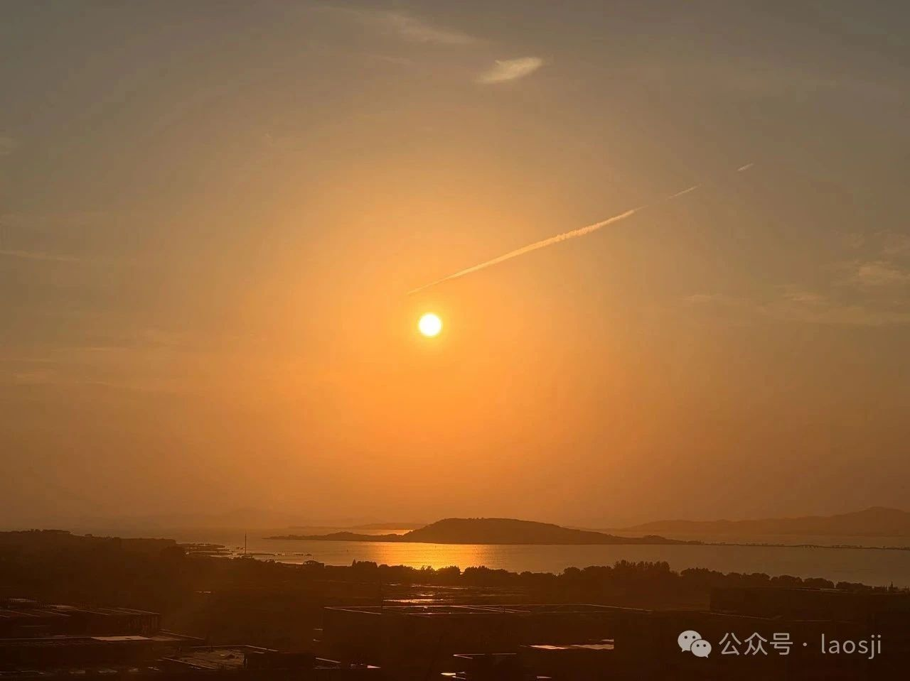
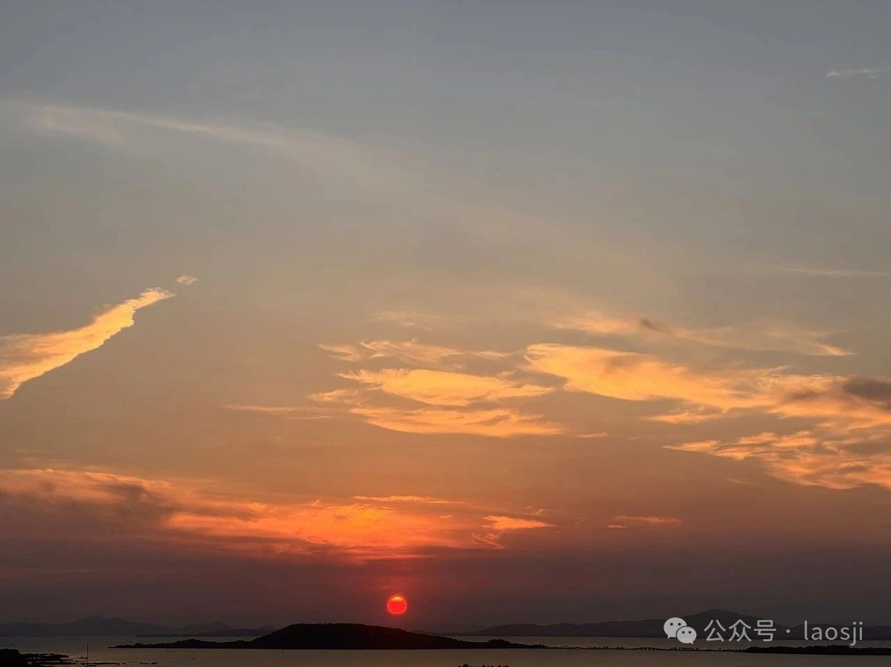

今天醒来一看，我C，平台通知3篇文章被删，好吧。看似，又紧了很多，不知道是不是因为最近开会的原因。删就删吧，大不了不发呗，但写还是得写。有条件的朋友抓紧关注油管 **“hklife”**，最近发布了很多视频教程，微信这边只能说个大概了。

---

昨天，Musk硬气怼完Trump之后，我以为这就要等着看好戏了。没想到今天又软了，大英雄果然都是能屈能伸。

美国6月ADP就业人数意外减少3.3万人，为逾两年来首次减少。不知道是AI正在取代人类，还是美国通胀显现了？

Anthropic年收入已经达到了40亿美元，AI正在取代码农。

Trump在“空军一号”总统专机上表示，他没有考虑延长各国与美国谈判贸易协议的7月9日截止日期，并对与日本能否达成协议表示怀疑。他表示可以对从日本进口的商品征收“30%或35%或任何我们确定的数字”的关税，这远高于4月2日宣布的对日本商品的24%关税税率。

---

今天上午，接待了几位开华美和IGM的客户，录好了视频的口播，下午剪了视频。额，还没有上传，明天起床再弄吧。晚上去看了个落日，所以，真的没有准备好今天要写的内容，给大家分享一下我的摄影作品吧。

---

> 生活不是一直顺风顺水，但好在总有落日和风，也有继续写下去的勇气。

---

📷 如果喜欢我的摄影或文章，欢迎在微信、油管、微博等平台关注“hklife”，谢谢支持！
