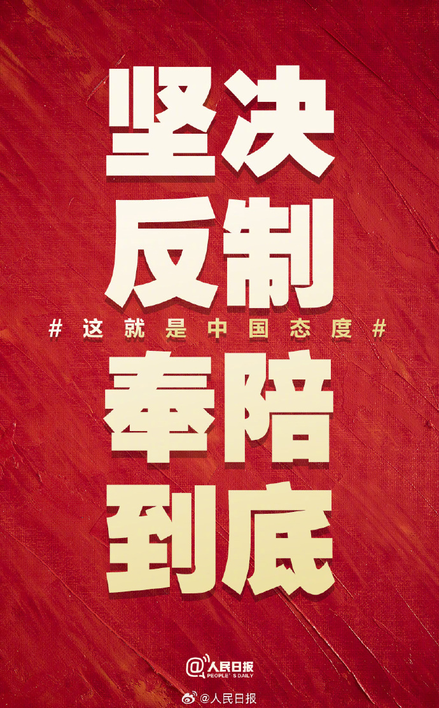

## 中美关税澄清

我国正式澄清：中美之间没有就关税问题进行磋商或谈判，更谈不上达成协议。  
目前关税是否下调，完全是美国自身的事务。  

> **点评**：若降税，肯定利好股市，但目前暂无更多进一步消息。期待早日开启实质性和谈！

---

## 俄乌局势更新

俄乌局势持续动荡。  
美国提出协议，要求乌克兰**非正式承认**俄罗斯对克里米亚及东部四州的控制，但泽连斯基本拒绝割让领土。  
川普批评泽连斯基延长战争，并施压乌克兰，称若不接受提议，美国将退出调解。

---

## $Trump Meme Coin 新动态

$Trump Meme Coin 活动开启！  
4月23日至5月12日期间，**平均持有量排名前220名**可参加川普举办的晚宴，**前25名**还能参加独家招待会并游览白宫。  

有兴趣的朋友可以通过这个链接参与排名：

👉 [Get Moonshot with my link](https://moonshot.com?ref=Q5ErHEkdvu)

---

## 马斯克与财政部长激烈冲突

据媒体周四报道，就在上周，马斯克与财政部长贝森特在特朗普及一众白宫官员面前爆发激烈冲突。  
争吵过程中脏话连篇，甚至几乎升级为肢体冲突！

- 马斯克指责贝森特是“索罗斯的傀儡”（Soros agent）
- 贝森特怒批马斯克“夸大DOGE预算削减成效”
- 双方沿着白宫走廊继续争吵，特朗普和意大利总理梅洛尼亲眼目睹全过程
- 最终靠助手干预才将二人分开

---

## 特斯拉财报数据

特斯拉2025年一季度汽车业务营收为140亿美元，同比下滑20%，较两年前锐减30%，创2021年以来最低季度营收。  
尽管短期盈利困难，但在自动驾驶与机器人项目上有所进展，仍为公司长期估值提供支撑。  
> **点评**：增长故事基本结束，但未来创新领域仍有想象空间。
