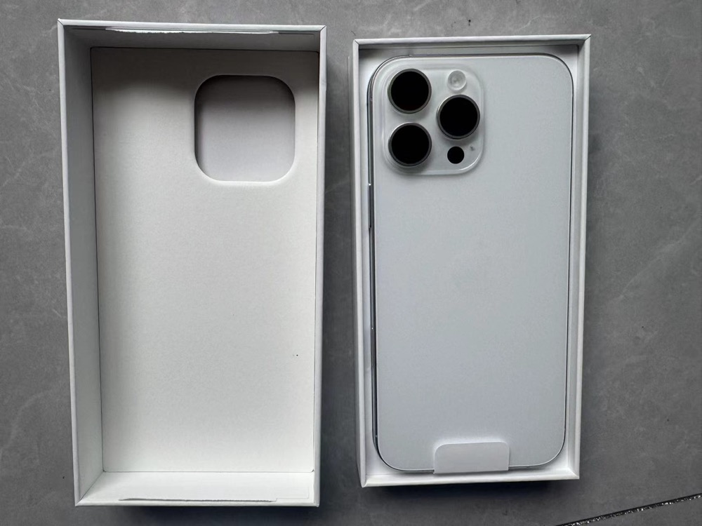
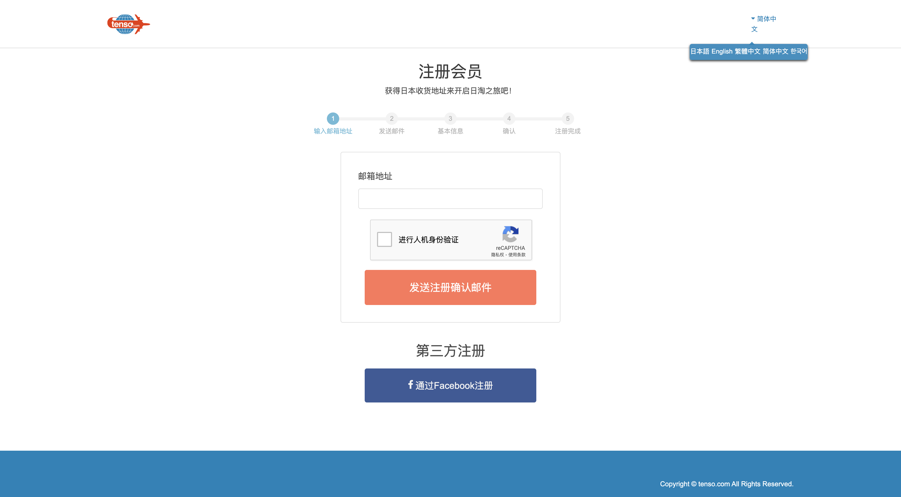
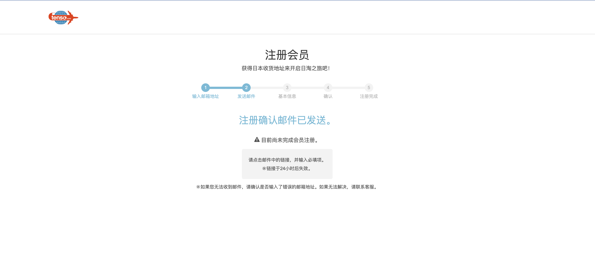
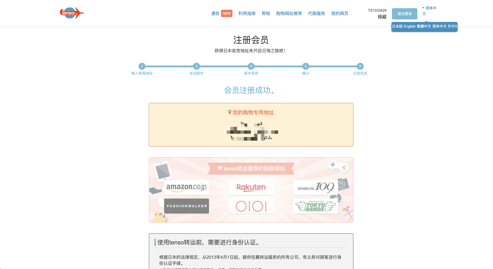
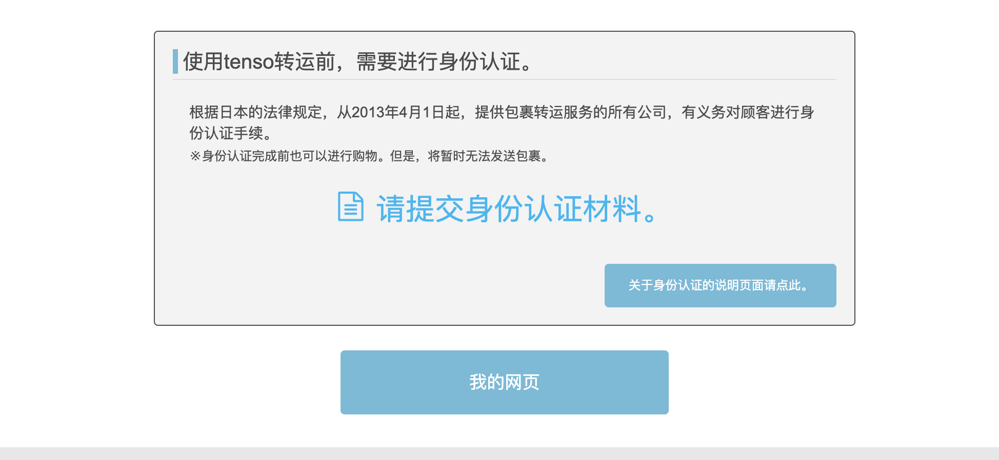
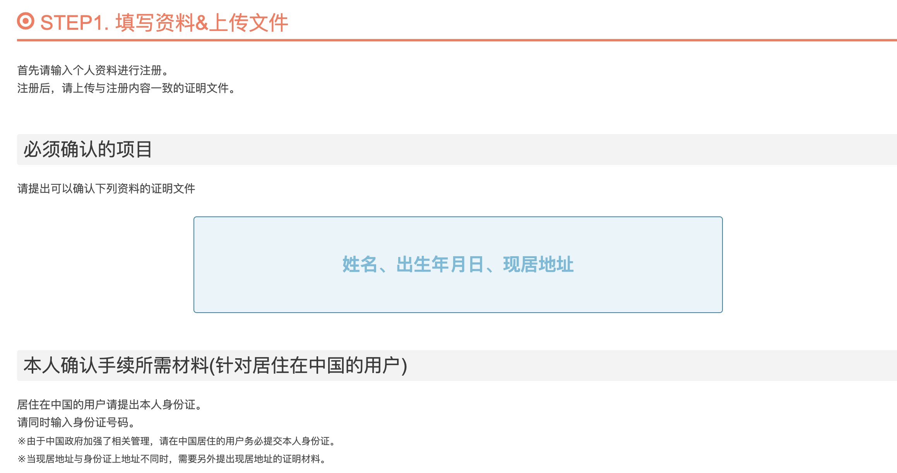
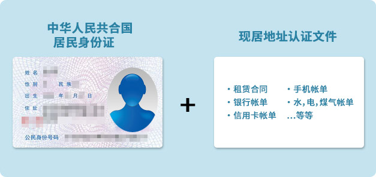
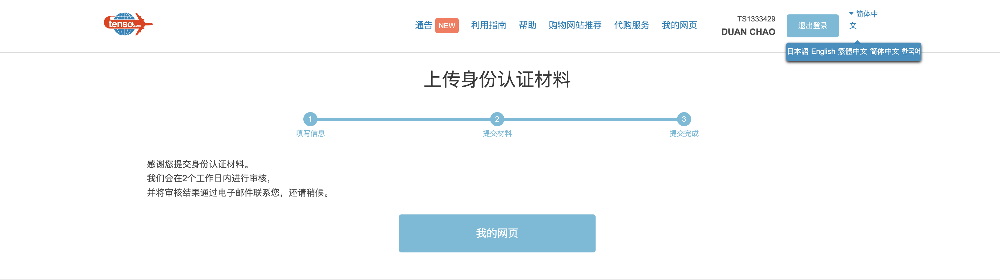
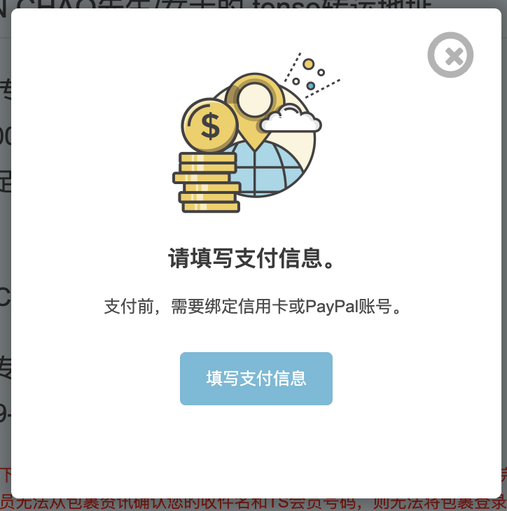
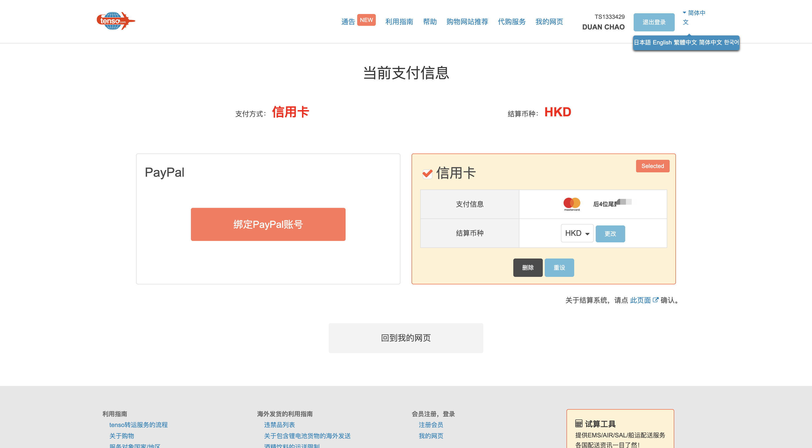

双十一就快到了，你加好购物车了吗？我好多年都不参与双十一了，感觉没什么好买的。不过偶尔去看看日亚、乐天、雅虎拍卖等，又会觉得什么都想要。日亚上面有的商品也是支持直接邮寄中国的，我之前在日亚上买了一个Sony的WH-1000XM4 耳机，就是直接寄回国内的，但是含税价格就比较贵了。如果你要买日本的马桶盖、婴儿用品、电饭锅、日版电子产品等，除了找日本的朋友或代购之外，通过转运平台，就能自己完成日本电商平台购物下单，然后寄到日本的转运仓地址，再通过转运回国。今天给大家推荐一个日本对的转运平台tenso，这是一家日本公司请放心使用（没有推荐链接和优惠券，完全是个人用爱发电），iPhone16发布后，有很多朋友已经通过tenso成功转运iPhone16Pro Max回国了。

使用tenso海淘流程

1. 注册 Tenso 账号，并完成实名认证，获取一个日本的收货地址。
2. 在日本购物网站购物时，收件人和地址填写tenso提供的日本地址。
3. 当 Tenso 收到商品后，会发送通知给你。
4. 去tenso官网选择转运方式（EMS、DHL等）并支付国际运费。
5. Tenso 发货，将商品转运到用户的目的

# Tenso 简介

Tenso 株式会社 (Tenso Inc.)成立于2008 年，是一家国际转运服务公司， Tenso 为全球83**个**国家和地区提供国际物流转运。非日本用户可以使用tenso提供的日本本地的虚拟收货地址，在日本购物网站下单（如 Amazon Japan、Rakuten、Yahoo! Auctions 等）。

# 注册Tenso

## 1. 注册账号

打开tense官网，支持切换中文简体。官网地址：https://www.tenso.com/chs/pre_regist/input，输入邮箱注册就可以了，不用接收手机验证码。

## 2. 填写注册基本信息

如实填写姓名、生日等信息，然后提交注册，就能获得一个日本地址。但是是使用之前，你需要实名认证。

## 3. 实名认证

需要填写你的基本信息和居住地址，然后上传身份证，如果你的居住地址和身份证地址不一致时，需要提供地址证明

## 4.提交身份证资料，等待审核

会在2个工作日内进行审核

## 5. 绑定支付银行卡

接下来，你就可以去绑定银行卡了。这里我选择绑定了汇丰Red信用卡。

完成以上步骤，就可以去购物了。比如去Apple官网下单一个iPhone16Pro Max，注意收件地址必须填写 TS 号，复制tenso完整地址就行了。

### 苹果官网怎么留tenso固话？

有个固话的勾选框，勾上之后就可以填写 tenso 给的电话了。

### 苹果官网为什么要绑定银行卡？

因为日本官网在发货前才会扣除全款，下单的时候不扣款。不过，需要先绑定银行卡，绑定的时候会扣100 日元用于账户验证，之后会退回来。下单后，有一定概率会砍单，砍单不用担心，钱会退回卡里。

### 为什么要买日版iPhone16？

就为了拍照那个咔哒声吗？其实日版iPhone在日本以外的地区使用并没有咔哒声，除飞行模式和无蜂窝网络情况下。另外，日版的iPhone支持eSIM和即将发布的苹果智能。不过，价格上没有优势，追求低价的朋友可以退了，买日版iPhone完全是为了图个功能完整。想不被收税的朋友可以转运到香港，然后人肉带回。买其他东西当然也一样啦。

### 日版iPhone转运费用

iPhone16pm 白 256 官网 189800 日元（招行 visa 转美金入账汇率 7.0735 ，最后入账为 9571.15 元）；转运 EMS 快递费加了保价一共 146 元，关税 1119.73 元（ 8613.31*13%）。注意报关的时候，一定要按照真实价格报税，不然会被退回。

# 上传文件时的注意事项

※ 请务必确认注册资料与上传文件上的内容一致。

※ 提交的身份证明文件上若同时记载现居住地址，只需提供一份身份证明资料即可。

※ 现居住址的证明文件上若没有记载您的注册姓名，则不可作为身份认证的证明文件。

# 若注册地址非现居地址

当您第一件包裹的收件地址与现居地址不同时，可以利用明信片来进行现居地址的确认。 首先，本公司会寄送一张认证用明信片到您的注册地址。

当明信片寄达后，请将明信片上记载的一组认证序号及会员号码发送至 [**客服中心**](https://www.tenso.com/chs/inquiry) 。

本公司核对资料无误后，将会修改会员帐户状态，完成身分认证的现居地址确认。 完成现居地址确认后，您就可以自由变更收件地址。