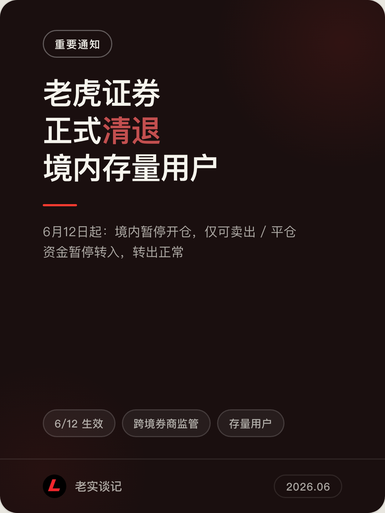
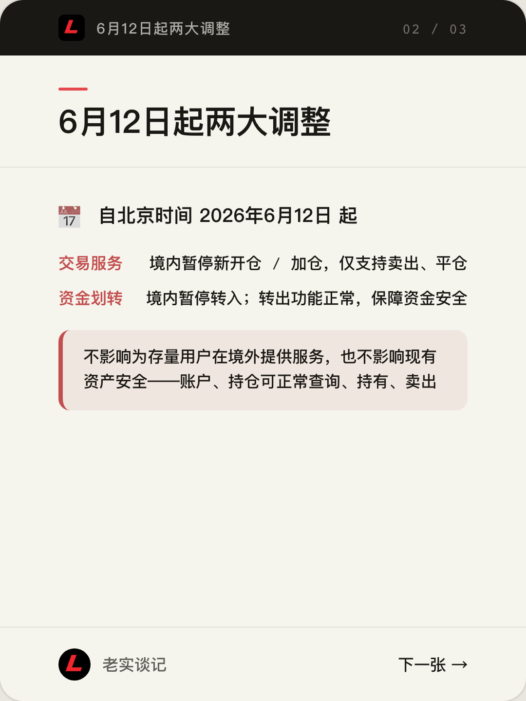
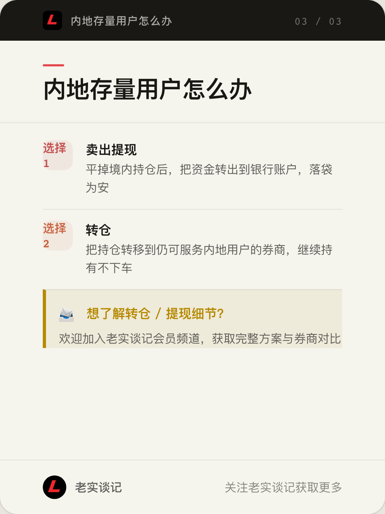

## 老虎证券正式清退境内存量用户

昨天，老虎国际（Tiger）发布通知：为落实 2 年集中整治期的行业监管要求、推动跨境证券业务规范发展，将对存量投资者账户在中国境内的服务进行相应调整。

## 6月12日起两大调整

自北京时间 **2026年6月12日** 起：

1. **境内交易服务**：暂停股票等所有品种的新开仓、加仓交易，仅支持卖出、平仓操作；
2. **境内资金划转服务**：暂停资金转入，转出功能保持正常，全力保障资金安全。

> **请放心**：本次调整不会影响为存量投资者在境外提供服务，也不影响全体客户现有资产安全。客户可正常查询账户、持有及卖出已有持仓。

## 内地存量用户怎么办

调整只针对**境内服务**，但趁转出通道仍然正常，建议尽早决定去留。接下来主要有两个选择：

### 选择一：卖出提现

平掉境内持仓后，把资金转出到银行账户，落袋为安。

### 选择二：转仓

把持仓转移到仍可服务内地用户的券商，继续持有不下车。

---

想了解转仓 / 提现的具体细节和券商对比，欢迎加入老实谈记会员频道获取完整方案。
