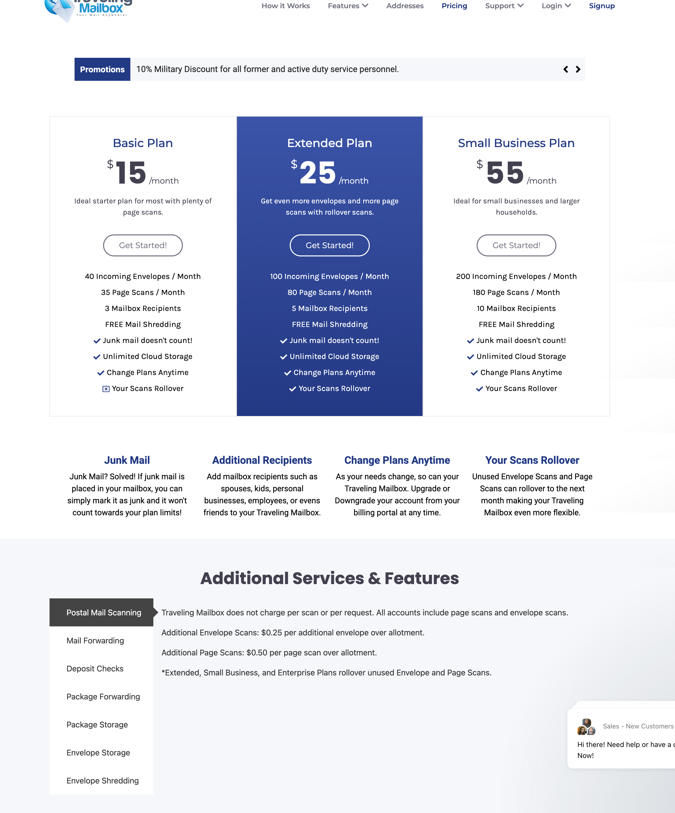

大家好，新年的钟声越来越近了，每到年底我都回总结一下过去一年中自己的成长与收获。过去一年我写了非常多有关香港和新加坡还有英国开户大的攻略，发现朋友们经常来问我攻略链接，确实文章太多了，就不太好找。所以，新的一年我将把所有的内容以专栏的形式进行更新，上周开了新专栏《美股成长日记》，有朋友给我留言说能不能给新手朋友分享一些注册和入金的基础教程，我觉得OK，不过内容都不宜公开，后续更新的话只能设置收费。接下来还会有关于数字游民攻略《香港篇》《新加坡篇》《美国篇》等，关于Crypto将只在油管更新。另外，我 最近改变了一下更新的节奏，一三五更新公众号文章，二四更新油管视频。
言归正传，今天前些日子也陆续分享了一些关于美国银行开户和ITIN注册的信息，也就是即将为大家带来的数字游民《美国篇》，老实说会有些门槛，很多服务都是收费的，不过我已经都提前帮大家踩坑了，今天来为大家分享一下“如何注册美国私人地址？

# ”美国私人地址有什么用？

作为赚美金的朋友，不论是做跨境电商、个人开发者，国际站站长，还是美国银行卡和信用卡玩家，有一个美国地址是必须的。我找了一些在用美国地址的朋友，问了问他们用美国地址来做什么？分享给大家一起来看下。接受支票、账单、信件。
- 作为数字游民，要申请美国的信用卡和银行卡就需要有一个ITIN，在申请ITIN之前就建议大家注册一个美国地址，用来接收美国IRS发出信函。用ITIN申请美国信用卡和银行卡之后，转运信用卡和银行卡回国，接收银行账单。
- 作为跨境电商从业者或者个人开发者，收款避免不了接收支票，所以有一个美国地址就能很方便的收支票。
- 海淘转运：参与美国本地促销活动比如“黑五”，然后转运回国；使用免税州的地址网购，可以享受免税商品。
- 跨境电商从业者可以用来接受退货。
- 还可以发送PDF到这个邮箱，然后让平台打印出来帮你寄出去。‍‍‍
- 注册美区Apple Account等。
- 注册ITIN和美国 EIN（雇主识别号），用于税务申报。
- 商业用途：当然了，如果你要注册美国公司，也可以注册一个美国商业地址用来注册美国公司。
在美国做生意的公司，不管是电商、服务型公司还是咨询公司，有一个美国地址能让你看起来更专业、更靠谱。我自己就有一个真实亲身经历，前几年Google Adsense提醒我要验证地址，当收入达到进行验证所需的最低限额时，Google 会通过普通国际邮件向您的收款地址发送一个具有唯一性的 6 位数个人识别码 (PIN)。我尝试了很多次，好几个月都没有最终收到PIN信件，后来无奈通过上传自己的身份证和信用卡账单的验证通过。当时，我还不知道有美国的虚拟地址这个服务，现在我也需要申请ITIN和美国的都信用卡、银行卡，借此机会就购买了美国的地址。

#  准备资料

在申请美国地址之前需要准备好一下资料，缺一不可。
- 护照/国际驾照翻译件，用来做地址认证。根据美国邮政法规，所有要接收USPS邮件的客户都必须进行Form 1583表格公证，这是美国政府的硬性要求。（这也是美国地址与其他国家的地址最大的不同之处）。‍

- visa/mater card，或者PayPal等，可以支付美金的银行账户。
好了，准备好这些我们就可以开始了。
我在开始之前，找了很多朋友咨询以及自己对比了很多家提供美国的地址的都平台，毕竟一年要二百美金，还是要找一个靠谱的平台，看到网上很多人介绍Anytime Mailbox，研究了一下发现Anytime Mailbox这个平台类似淘宝，只不过卖的商品是美国地址，有很多商家来提供，这就会导致地址质量很难保证。最后选择了美国当地人也会用的Travelingmailbox，这个在reddit上也有很多推荐，而且用Travelingmailbox最大的好处是“不用找第三方公证，平台提供免费公证服务，注册好地址之后，只需要预约视频认证就可以了”。
「Travelingmailbox注册地址」：https://travelingmailbox.com/?ref=3435 
年付可以节省2个月的费用，也就是说付10个月的费用，可以用一年，送的这两个月用来申请ITIN差不多够了。选择了Travelingmailbox这个平台之后，我们先不着急付款，先来找找有没有符合自己要求的地址，我们尽量要找个人地址，商业地址的话申请信用卡和银行卡不一定行。另外，看你是用来购物还是申请信用卡，海淘购物的话找免税州，比如：阿拉斯加、特拉华州、俄勒冈州等。申请信用卡的话可以找大城市地址比如纽约、华盛顿等。
现在打开Travelingmailbox官网，来找个地址，然后查查这个地址是不是个人地址。

## 查地址
在这里查：https://www.smarty.com/products/single-address，当地址CMRA为N的时候就表示可以被银行接受。选好地址之后，就开始注册吧。

## 注册步骤
打开这个注册链接：https://travelingmailbox.com/?ref=3435 ，我找到地址之后，选择了Basic Plan，怕被用滥所以我就不公布我选择的地址了。

## 点击Get Started，开始注册。
选择地址‍‍在这里找到自己查好的地址，并点击“Subscribe Now”，继续注册。‍‍‍
选择套餐‍‍为了让大家看得明白，我用Google翻译了一下，我选的这个地址要19.95/月，结算周期我直接选了一年，可以免费2个月。一共需要支付199美元，检查一下 没问题。

## 点击立即订阅，去付款吧。
支付这个页面需要我们输入注册信息，姓名注意，要按照美国的习惯。first name写名字的拼音，last name写姓的拼音。我之前申请美国汇丰按照我们中文的顺序，客户经理就告诉我是不行的。
‍‍支付方式的话让大家准备的万事达或Master card可以拿出来了，我用汇丰Red来支付的，非常快就完成了。本来想用PayPal，结果一看PayPal账户只有1百多美金不够199，先让PayPal账户继续躺着吧。‍‍‍‍‍‍‍‍

‍‍‍‍‍‍‍‍注册完成后收到了4封邮件，其中有一封非常重要，需要我们点击链接激活账户。

## 提交1583表格‍
登录成功之后，就会有一个提示，开始填写USPS 1583表格，我们认证完成之后才可以正式使用这个地址。接下来就要用到我们的护照和国家驾照翻译件了。这里填的地址信息要和国际驾照上面的地址一致。
注册页面底部的Yes和No，不要点错了。‍‍‍‍‍‍‍‍‍‍

## 视频认证
提交之后，我们就可以取预约视频认证了。
直接点网站右下角的在线客服，这个在线客服做的不错，用起来很方便，注册完成后会提示你有哪些待办事项需要完成。我们点击在线客服的图标，然后就会显示很多选项，我们点一下“USPS 1583 Video Verification”，由于时差关系，系统自动回复了不在工作时间，等他们上班再联系吧。到这里我们就就有一个美国地址了，你会了吧。想要和我一起玩美卡的比如Apple card、 C1 、大通chase、Bank of American、Citi Bank、American express等等，快来注册吧。‍‍‍‍‍‍‍‍‍‍‍‍‍https://travelingmailbox.com/?ref=3435

国家驾照翻译件在租租车上付邮费就能办。‍‍‍‍‍‍‍‍‍‍美国ITIN

