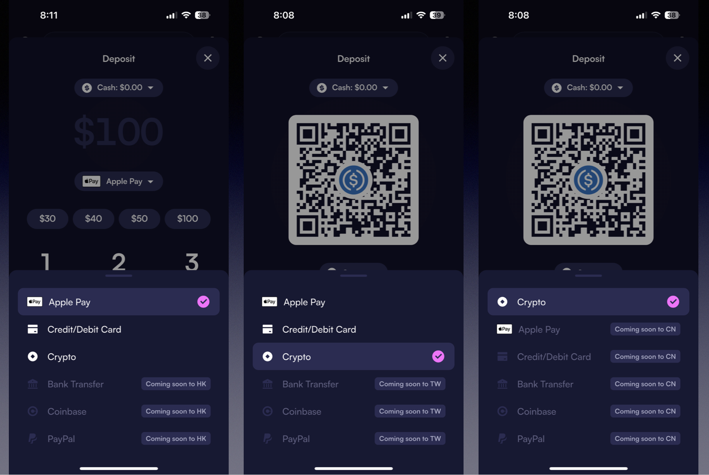
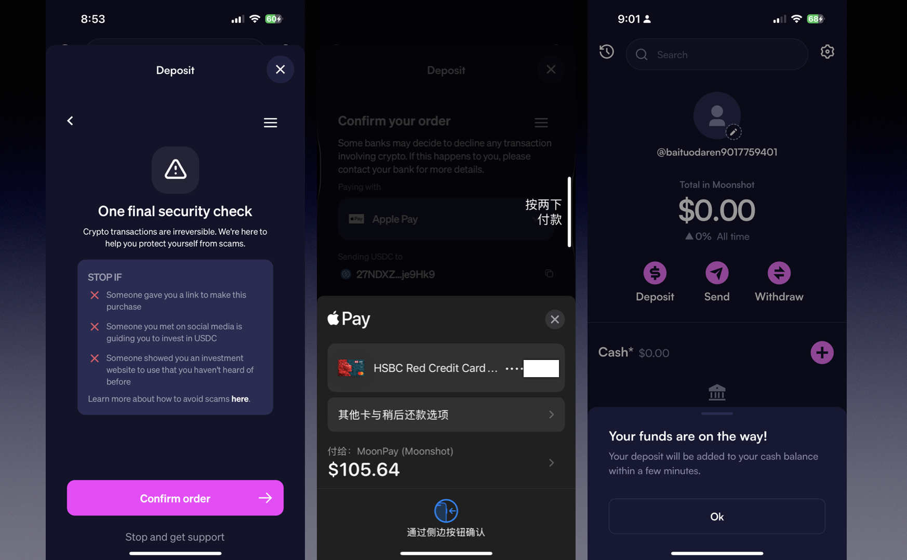

大家是不是都在等着放假啦！本来打算从上周末开始休息的，年底各种活动狠狠的摔在了我眼前。众安和汇立银行注册活动更新了，雪盈证券也第一次推出了入金奖励活动等，有需要的朋友加我直接留言。今天是Trump总统正式上任的时间，TikTok已经被Trump救了回来。另外，Trump还说要废除拜登在任期间的所有新政，开年大戏简直太刺激了。Trump1月18日在X平台上官宣推出TRUMP币Meme coin，一个总统发自己的数字货币，也真是没谁了，宇宙第一总统特没谱。很多朋友都来问了怎么上车Meme，今天简单说下，要了解详细步骤大家要移步油管。

TRUMP币的官方网站将其称为“唯一的官方特朗普Meme”。官网资料显示，该代币80%的供应量由特朗普旗下公司CIC Digital和CIC共同拥有的一家名为“Fight Fight Fight”的实体持有。该网站称，目前有2亿枚代币可供交易，预计在未来三年内流通量将增至10亿枚。

与此同时，TRUMP币的官方网站还包括一份免责声明，指出TRUMP币“不打算成为或成为”投资机会或任何类型的证券的主题，并且“不是政治性的，与任何政治竞选、政治办公室或政府机构无关”。

# **如何上车？**

Trump币是建立在Solana开源平台之上的，目前官方推荐的购买平台是Moonshot，就是trump发推文的那个链接，点进去购买会跳转到Moonshot。Moonshot目前功能比较简单，使用没有难度，支付便捷，也是数字货币便捷支付平台MoonPay旗下的产品。由于trump官方已经背书了，就不多介绍了，直接上链接。

https://moonshot.money?ref=Q5ErHEkdvu

我们下载好APP之后，需要用🪜，大陆IP无法直接用法币购买。香港IP支持Apple pay，帮大家测试了一下港卡都是可以直接充值的。

**如何注册？**

注册非常简单，只需要输入邮箱，但是在充值的时候，需要做身份验证，填写你的KYC资料，以及地址证明。有朋友给我说，充值身份认证不过，多操作了几次居然不让提供地址证明了。目前平台审核不严，可以输入任意新加坡香港等地址，当然大陆地址也是可以的，只是大陆网络环境下不支持Apple pay、网银、银行转帐，只能从其他交易所转数字货币充值。

就说到这，感兴趣的的朋友，加我我们来建群。

先通过以下官方链接下好APP：

https://moonshot.money?ref=Q5ErHEkdvu

目前港卡通过Apple pay都是可以支付的，大家到香港可以通过我的邀请码注册众安银行和汇立银行账户。

[ZaBank「众安银行」最新开户活动来了！到港在线注册可获得最高可得500港币奖励！](https://mp.weixin.qq.com/s/Sva-gUYei_hoNUAQ-_5UXg)

[WeLab「香港汇立银行」实体卡首发，终于推出，可EMS/顺丰邮寄内地！千呼万唤始出来，卡面使用无卡号设计](https://mp.weixin.qq.com/s/fVzR3TY6qnIalFH_4Zho4g)

[iFast旗下iGM「奕丰环球市场」内地开户攻略：顾问认证，全程在线开户，欢迎随时光临iFast内地办公室](https://mp.weixin.qq.com/s/7gho1C7o6bQYSks5XHOOLg)

电报群：立即加入  https://t.me/laosjigifts

「福利」：以下都是本人测试过的一些App，新用户注册可领奖励。可查我的历史文章，或[自助领取](https://mp.weixin.qq.com/cgi-bin/appmsg?t=media/appmsg_edit_v2&action=edit&isNew=1&type=77&createType=0&token=1203036795&lang=zh_CN&timestamp=1737342148106)：https://fl.laosji.net/

「常用网址导航」：https://dh.laosji.net/

「油管频道」：https://www.youtube.com/@laosji