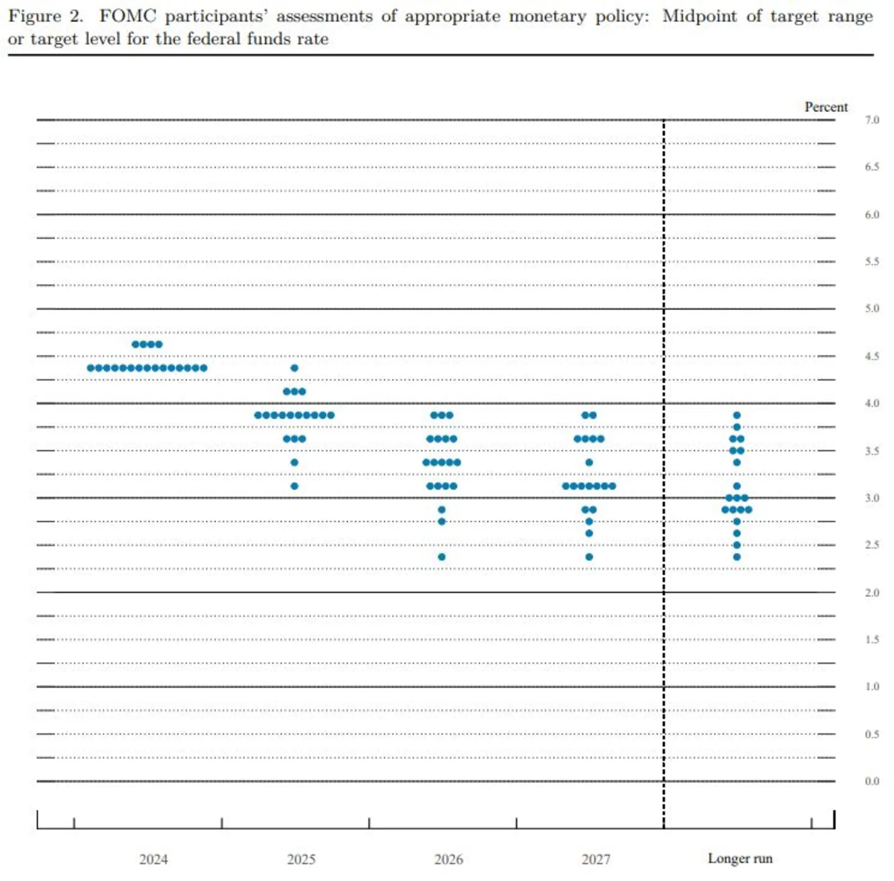

大家好，我从今天开始写一个新的专栏，名字叫《美股成长日记》。本来想了好几个名字，比如“美股惊魂记”、“美股日记”、”美股历险记“等，我觉得都不够理想。最后，去问了一下ChatGPT，他给我了一些参考，其中”美股修炼手册“这个名字看着挺顺眼的，就拿来改成《美股成长日记》。当然了，我也不是投资专家，所以，用”成长“这个词可能更符合我对自我的定位。那要写些什么呢？其实也没想好，就先把我自己玩美股的流水账先记录一下，毕竟是免费分享，请大家不要抱有什么专业技术分享的过高期待。

# 为什么要写这个专栏呢？

其一、我自己是一个美股的典型日内短线交易者，之前我是一个习惯早睡的人，一般10点半左右就睡了。自从玩美股之后，就得熬到12点左右（对我来说已经是熬夜了），那熬了这么多夜不能白熬呀，自己有时候也挺想记录一下当时的心理活动和我观察到的一些市场的变化情况。其二、今天早上4点多起来看盘，全线飘红，就Meta每1股就跌了20美金（具体的持仓就不分享了），就特别想找个人交流一下，这种感觉是之前从未有过的，以前我是绝对会排斥跟别人交流这些事情。还有第三点就是我自己本身是一个内容创作者，要写东西，也爱写东西，有时候不知道写什么好，那写个专栏也不用在费尽心思去挖题材。还有另外一点，就是对自我身份的矫正，之前好几个付费咨询的朋友老问我是干什么的，我说是做自媒体的，他们可能觉得比较抽象，昨天来找我付费咨询的朋友更好玩，说我是教别人薅羊毛的人。不知道我写了这个专栏之后大家又会怎样称呼我，我觉得怎么称呼都行，先写吧。

多久更新一次呢？看心情吧，尽量一周一更。

# 12月18日

要开始咯！（前方美股巨震，请系好安全带）

今天晚上有个大事件，美联储将公布最新的货币政策，今天早上看到消息，在2024年12月18日的会议上，美联储宣布将联邦基金利率目标区间下调25个基点至4.25%至4.50%，这是自9月以来连续第三次降息。

正常来说降息是利好股市的，但是为什么美股集体跳水了？这很罕见！

**鲍威尔在新闻发布会上表示：「通过今天的降息，我们将政策利率从峰值下调了整整一个百分点，因此，在考虑进一步调整政策利率时，我们可以更加谨慎。**

美联储发布的中期利率预测显示，预计2025年美联储仅会降息两次，每次25个基点，低于之前的预测。

**以下是 19 位 FOMC 成员（包括有投票权和无投票权的成员）提出的最新美联储目标：**

点阵图显示了美联储官员们对利率的预期，点阵图显示，官员们预计到2025年底，基准贷款利率将降至3.9%，相当于3.75%至4%的目标区间。美联储此前在9月份的会议上预计，2025年将降息四次，每次25个基点，即降息一个百分点。

美联储对未来降息预期降低，表明通胀就有可能卷土重来，我今年听到各处都在说美国经济软着陆，整体向好。再加上特朗普就职后实施新的关税政策，他自己也说过不能保证关税不会导致物价上涨。

结果就是**道指下跌1,123.03点，至42,326.87点，跌幅2.58%，创下1974年11天下跌以来的最大连跌纪录。**周三的跌幅是自8月以来最大的，也是今年以来第二次在一个交易日内下跌1000点。 标准普尔500指数下跌2.95%，至5,872.16点，纳斯达克综合指数下跌3.56%，至19,392.69点，收盘时跌幅加大。

# 我的持仓

我前几天买了已经触底还未反弹的Uber，昨天竟出奇的涨了，已经持仓超过1个礼拜。昨天剪了一天视频，一直到晚上10:30才搞完，眼睛实在受不了了。开盘后我去设置了63.8卖出uber一部分，65卖出一部分，然后就睡了。早上4点起来一看，昨天晚上Uber的最高价是63.9，成了一单。有朋友肯定会说我这样下单，交易成本比较高，但是可以在保住基本收益的情况下博取更大收益，而且交易成本对我来说就是工具，要利用得当，而不是只追求最低的交易成本。请大家不要模仿，切记不要跟着我买，我自己的原则是不荐股！否则，后果自负！

Meta更惨了，昨天盘前是涨的，我昨天买入的成本价是620，睡前一度涨到627，感觉不是很妙，就设置了628卖出，结果627是昨天的最高价了，不过最近有一些利好消息，还是不慌的。

其他的Google和Apple还有Tesla最近涨的太猛，尤其是Tesla，不太敢冲。上周五，没记错的话185买了Google，最后收盘涨到了196，遗憾的是我设置了186就跑了，刚设置完自动卖出，猝不及防到的就交易成功了。当天仓位有点大，也没有买其他的，选择落袋为安就去睡觉了。押注一只股票的风险确实有点大，最好是要分散风险，均衡配置，不能只押注一个。还有就是控制自己的贪婪、和恐惧，不能有一夜暴富的幻想，在股市中赚钱是得看机会和趋势，但是过于贪就容试图冲击自己预测的最高点，然后被套进去。跌了要控制不慌、不焦虑、不恐惧，也不能一直在等自我预测的最低点。要有一个长期主义思维，我之所以选择日内交易，是因为我验证自己对市场的一些看法，并且每次能够预测正确都非常激动，对我来说是一件很有趣的事情。如果我没有这么多时间和精力的话，那我也会去长期持有一些股票，比如特斯拉217我卖掉了，现在4百多，Meta我曾经最低买入价是550，后来582卖掉，最近涨到过630以上，如果长期持有的话，也是非常高的回报。在接下来，我会在合适的时间选择长期持有一些AI公司的股票，另外，就是做一个更积极的典型日内交易者。

写到这里我感觉分享持仓有点不太好，因为我真怕有人跟着我买，很多博主就是这样毁掉的。不过，可以分享一下我个人最近的选股心法。我只买2种股票，一种是股价高的，单股500美金以上，这种股票散户比较少，而且涨幅虽说看着比较低，但实际涨的金额不小。第二种就是股价低的，以量取胜，一股赚一块钱那你一天的收益也不少了。比如我最近12美元买的SoundHound AI，我已经出掉了，现在涨到了20美元左右。


