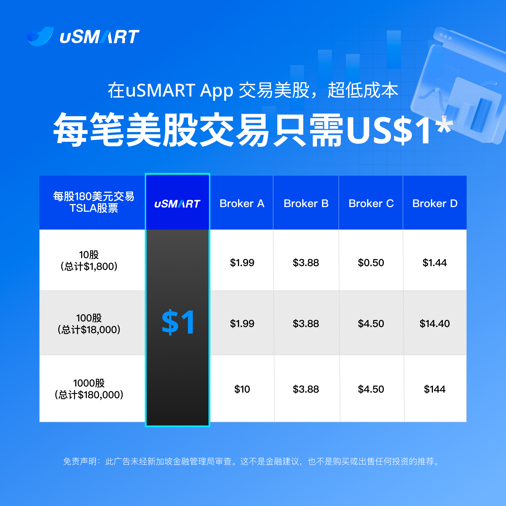

[阅读原文](https://mp.weixin.qq.com/mp/wappoc_appmsgcaptcha?poc_token=HPeyhGajGVMi5CH6rGMV6aJtfVUYVBU4G3Xdyo-u&target_url=https%3A%2F%2Fmp.weixin.qq.com%2Fs%2FVDVYVgjN1g_lBv1oMsKIaA)

# 新加坡和香港券商有什么不同？

- 注册简单，不需要提供存量投资者证明，也不需要绑定国内银行卡验证身份。
- 使用货币不同，用新加坡本地银行卡免手续费入金，所以入金的话用新币就好，买美股的话可以在平台换成美金。
- 出入金方式不同，新加坡券商支持wise和香港的银行出入金，但是我们还是首选首选新加坡OCBC，理由是在线就能开户，没有任何开户门槛。
- 新加坡券商的开户奖励的现金券都是美金。
- 最牛的就是在新加坡券商平台可以交易数字货币ETF。

本质上没有什么区别，因为港美股能买的都是那些上市公司，只是货币汇率不稳定可能存在损耗不一样，但是这些对真正想要炒股来说可以忽略不计。

# 适合人群

- 港美股入门新手，无法开立香港银行账户，无存量投资者证明
- 全球薅羊毛的小能手
- 想要合法安全持有数字货币资产的朋友

# 新用户入金奖励

1️⃣0.02股特斯拉股票

2️⃣新人礼包（USD 14现金券）
3️⃣现金卷：最高领取180美金
【2选1现金券礼包】
1、首次入金600美金
即6美元×6张= 36美金
2、首次入金2000美金，或者1.6万港币or 2700新币，奖励30美元X6张=180美金
🧧具体奖励细则在手机app，点击【我的】【奖励中心】查看

# 费率

- 新加坡合资格用户的美股交易, 实行0佣金，固定 $1/笔平台费。
- 非新加坡用户佣金每股0.003美元，每笔订单最低0.50美元，最高 0.50% *成交金额，平台费每股0.005美元，每笔订单最低1.00美元，最高 0.50%* 成交金额。低于绝大部分美股交易平台。
- 美股期权现在0佣金*，免最低下单费用。

# 注册链接

微信直接打开下面链接即可开户，手机号码选择+86

🧧盈立证券开户链接SG：
[立即注册](https://m.usmartsg.com/promo/overseas/sg-register.html?langType=1&HCode=nyaljb&HBox=1#/marketing-register)

邀请码：nyaljb

# 盈立证券介绍

持有香港和新加坡牌照，创始团队来自阿里巴巴，获得周大福战略投资，该集团是香港最大的企业集团之一。

# 开户流程提示

手机号码选择+86中国
开户选择：
1. 身份证
2. 个人账户
3. 标准账户
4. 居住地址和身份证选择一致
5. 手机app下载：uSMART SG

提示：要通过上面链接开户才有奖励

# 出入金

## 新加坡幣：

1）[eGIRO入金](https://m.usmartsg.com/webapp/market/generator.html?id=10829&appType=12)

2）[PayNow入金](https://m.usmartsg.com/webapp/market/generator.html?id=10826&appType=12)

3）[Fast入金](https://m.usmartsg.com/webapp/market/generator.html?id=10822&appType=12)

4）[Wise入金](https://m.usmartsg.com/webapp/market/generator.html?id=11167&appType=12)

5）[BigPay入金](https://m.usmartsg.com/webapp/market/generator.html?id=11049&appType=12)

6）[銀行帳戶轉賬入金](https://m.usmartsg.com/webapp/market/generator.html?id=10830&appType=12)

## 电汇入金 （美元和港幣）

1）[銀行帳戶轉賬入金](https://m.usmartsg.com/webapp/market/generator.html?id=10830&appType=12)

2）[Wise入金](https://m.usmartsg.com/webapp/market/generator.html?id=11167&appType=12)

3）[BigPay入金](https://m.usmartsg.com/webapp/market/generator.html?id=11049&appType=12)

我用的是PAYNOW入金方式，我就以OCBC做了个入金，只用扫二维码就行了。（当然我也有其他的银行卡，OCBC可能用的更多点，所以就用新加坡OCBC入金给大家看下。

先在uSMART SG移动应用中，点击“交易-入金”然后选择“新加坡币入金”，入金方式选择PayNow。然后根据页面提示，给盈立证券UEN账户转账。

# 盈立证券的优势：

1. 平台值得信赖放心
创始团队来自阿里巴巴
获得香港周大福战略投资
该集团是香港最大的企业集团之一

2. 可以直接开户：
港股+美股+新加坡股票账户

3. 可以直接下载手机app

4. 手续费相对友商便宜
目前有期权有免佣活动中

5. 香港银行出入金
或者华侨银行ocbc
绑定入金，实时到账

6. 新用户奖励，高达近200美金

[阅读原文](https://mp.weixin.qq.com/mp/wappoc_appmsgcaptcha?poc_token=HPeyhGajGVMi5CH6rGMV6aJtfVUYVBU4G3Xdyo-u&target_url=https%3A%2F%2Fmp.weixin.qq.com%2Fs%2FVDVYVgjN1g_lBv1oMsKIaA)