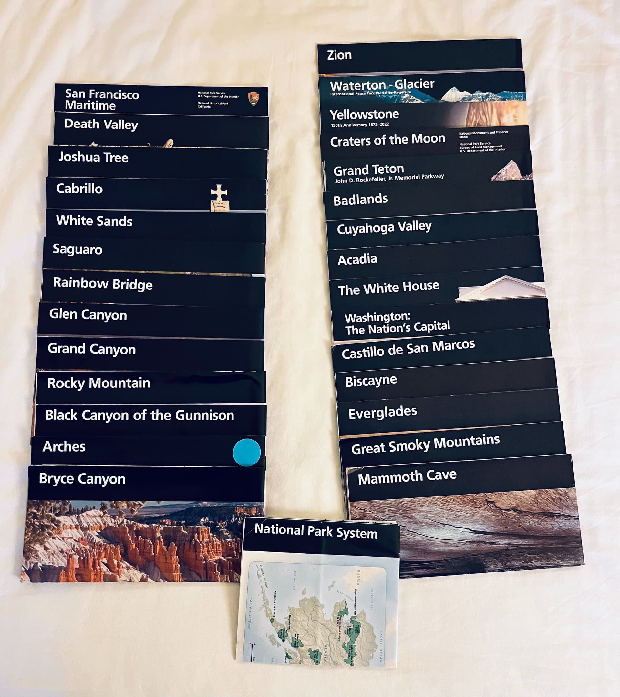
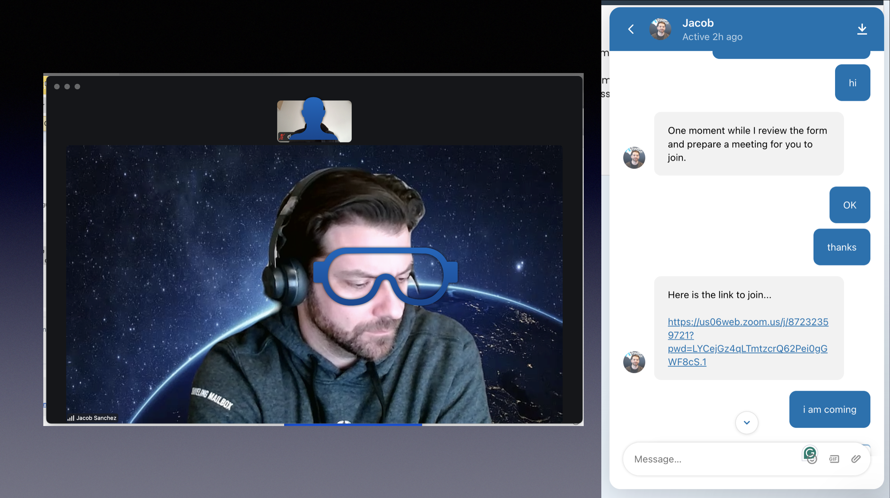
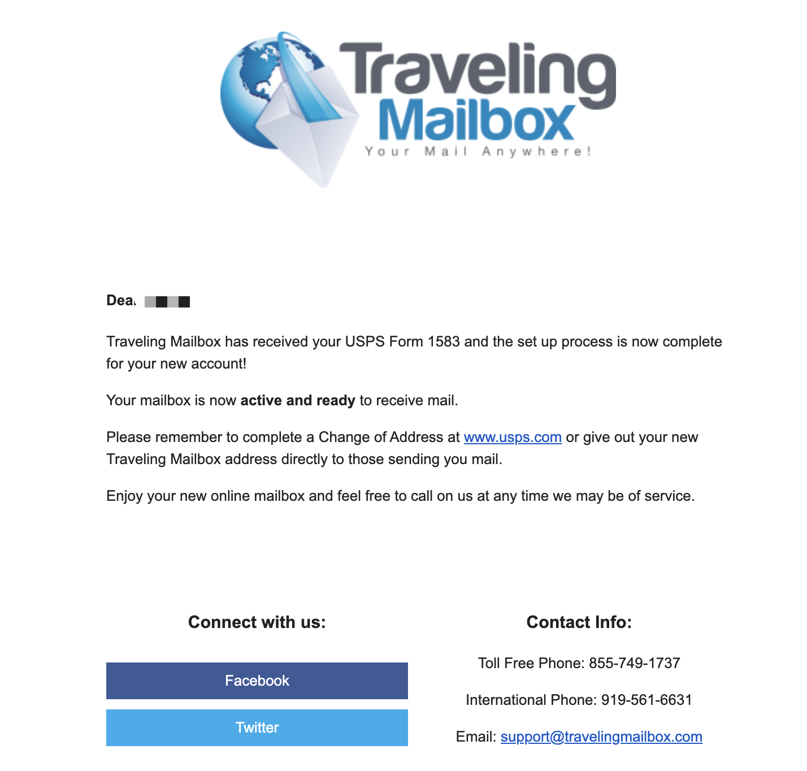
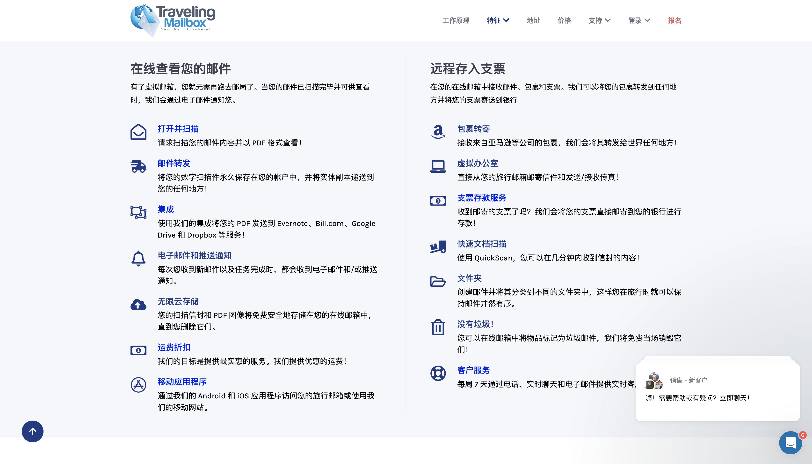

圣诞节快乐！前天我分享了我自己如何注册了一个美国私人地址，收到了一些留言和私信，有朋友可能是才关注，还不了解地址服务商提供的服务，还有朋友问我这个可以做美国地址证明吗？等问题，我会在文末进行回答。昨天一大早5到点就醒了，实在不想起，躺到7点多，突然想起来现在可以找t Travelingmailbox在线客服预约一下USPS的1583表格视频认证，然后就起床找在线客服聊天。没想到回应非常快，马上就约好了，用了3分钟就完成了USPS的1583表格视频认证。今天来分享一下在注册地址之后，如何完成USPS的1583表格视频认证。

注册地址：https://travelingmailbox.com/?ref=3435

了解美国信用卡的朋友可能知道，大多美国的信用卡和银行卡都支持用ITIN来申请，申请ITIN之前最好先注册一个美国地址，可以用来接收IRS的信件以及之后申请的银行卡和信用卡等一起转运回国。关于Travelingmailbox这个平台，我在查资料的时候看到了一个非常精彩的故事，今天也来给大家分享下。有一个在美国工作的博主和他朋友自驾，用了234天时间完成了一次美国公路旅行，这期间他们就使用travelingmailbox这个平台收到了12张信用卡，信用卡的酒店积分奖励共抵了5k美元的酒店房费（大概够住一个半月）。然后，也发现很多曾经在美国生活过的人也推荐它，虽然贵点，但是服务非常好，免费提供1583表格的视频认证服务，这也是我选择Travelingmailbox这个平台原因之一。看到网上一些攻略在这买的地址，又去fiverr找代理做1583表格的视频认证，费劲费大了。颇有木兰出征的感觉，东市买骏马，西市买鞍鞯，南市买辔头，北市买长鞭。（木兰将军，请原谅我的瞎扯）

# 如何预约视频认证？

在你的travelingmailbox中，不管你登录的是App还是网页版，就直接找在线客服告诉他你需要做USPS 1583 video verification。然后等个1-2分钟就会有人工客服来回复你，我是去上了个厕所回来就看到回复了。客服让我等一小会儿，他先看一下我的资料，然后准备一个meeting给我。趁这会儿，我就把护照找出来，喝了杯热水，3-5分钟左右，他就给了我一个meeting的链接。

# 视频认证过程

点meeting链接加入就行，这里大家需要提前下载好zoom，减少等待时间。这里我出现了一个小插曲，因为用了VPN，zoom没有视频画面，我这边能看见他，他看不见我，我听到他跟我说他看不到我，让我调整一下设备，然后我断开vpn就正常了。

有了画面之后，他让我出示一下护照，然后说给我邮箱发了一个表格让我签个字。我等了半天，不见邮件，然后我就说先截个视频认证的图片，结果截图工具把我的麦也关了，不知道是不是快捷键冲突的原因。还好我等不及了，看了一下手机才明白过来，电脑VPN关了，邮件查不到。于是就在手机上，打开邮件，也是一个文档链接，需要确认签字，这个系统非常方便，已经生成好了签名，你只需要点击“签名”就好了。签名完成后，会给你邮箱也发一份表格，带双方签名的。然后，他说了一长串我没怎么听懂，只听懂了最后一句，视频认证完成了，看到他上班有点疲惫，正好快到圣诞节了，我就跟他说了一句“merry Christmas”，他非常开心的回我“you too”，就这样愉快的完成了视频认证，全程3-5分钟时间就行。如果你英语不好，可以跟他说“My English is not good，please speak slowly，thanks so much”。不然，他们说话语速非常快，就和我一样只能听到几个单词，听起来挺费劲的。

昨天一大早完成视频认证之后，带着喜悦的心情，把从注册地址到完成认证的全过程做了一期油管视频，欢迎各位朋友到油管来看。视频和文字确实有很大的区别，所以在视频中讲的内容也会不太一样。

# Travelingmailbox提供哪些服务？

一般情况下，在线地址服务商都会提供包裹转运、合并包裹并转运，信件扫描（可以在线查看PDF）、文档扫描、美国的地址服务商还提供[支票存款服务](https://travelingmailbox.com/check-deposit-services/)。

# **注册Ttravelingmailbox地址可以作为美国的地址证明吗？**

注册travelingmailbox只是为你提供一个美国地址，用于收发邮件等，这里没有任何提供任何地址证明。并且1583表格也不能作为地址证明，因为它不能代表你现在居住在这里。关于美国的地址证明文件，后面申请信用卡的时候，再分享给大家。

# 为什么要做 USPS 1583表格认证？

‍**USPS 表格 1583 是美国邮政服务 (USPS) 要求任何希望在 USPS 邮政信箱接收邮件的个人或组织提供的文件。**该表格用于验证申请人的身份并授权 USPS 将邮件投递至指定的邮政信箱。

根据规定任何打算在 USPS 邮政信箱接收邮件的个人或组织都必须填写 USPS 表格 1583，该表格作为验证收件人身份的文件。用于授权 USPS 将邮件投递至指定的邮政信箱，该表格必须由申请人填写并签名。该表格要求申请人提供个人信息，例如姓名、地址和出生日期，以及希望接收邮件的邮政信箱地址。申请人还必须提供两种形式的身份证明，例如驾驶执照和护照，以及可以验证申请人身份的证人。‍表格

填写完毕并签名后，申请人必须将其提交给 USPS 以获得邮政信箱。 USPS 使用表格上提供的信息来验证申请人的身份并授权将邮件投递至指定的邮政信箱。

‍