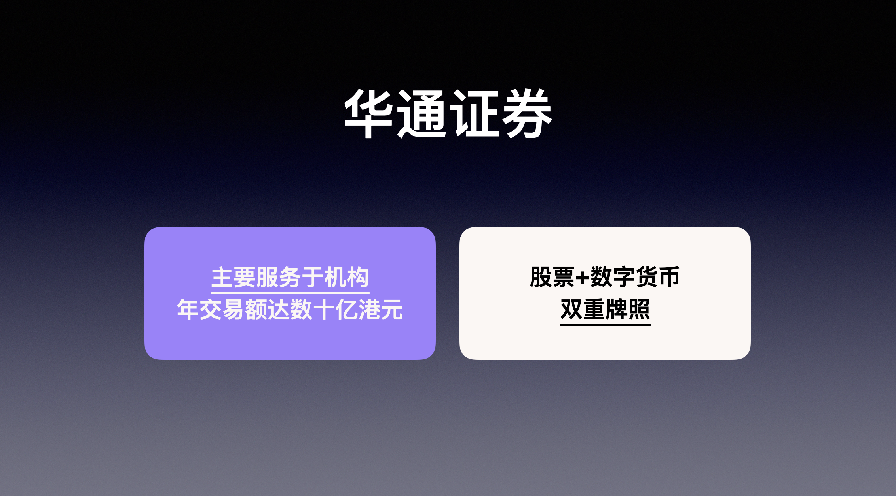
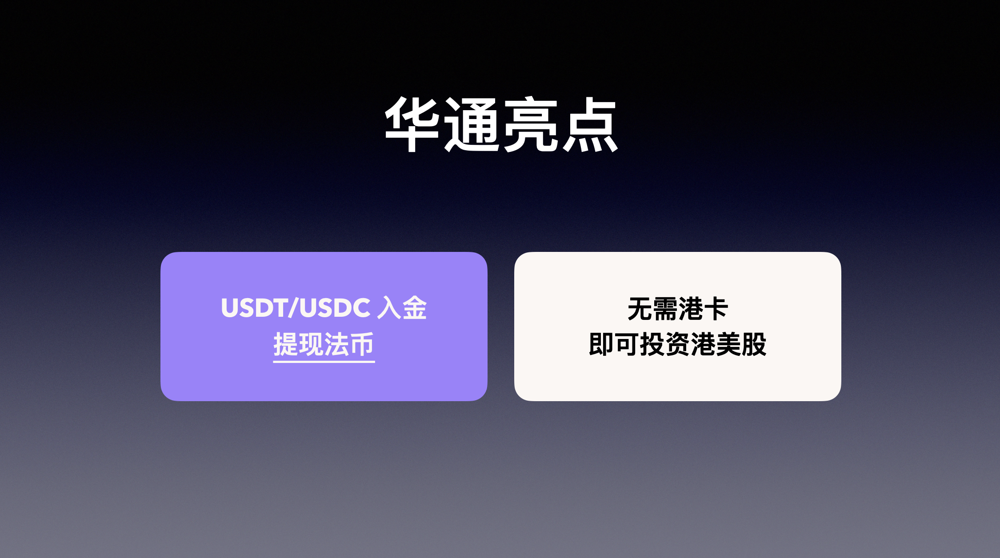
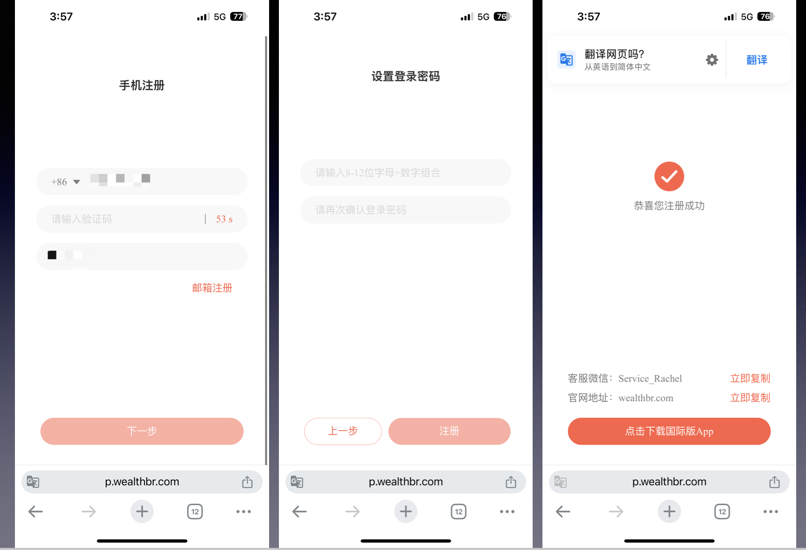
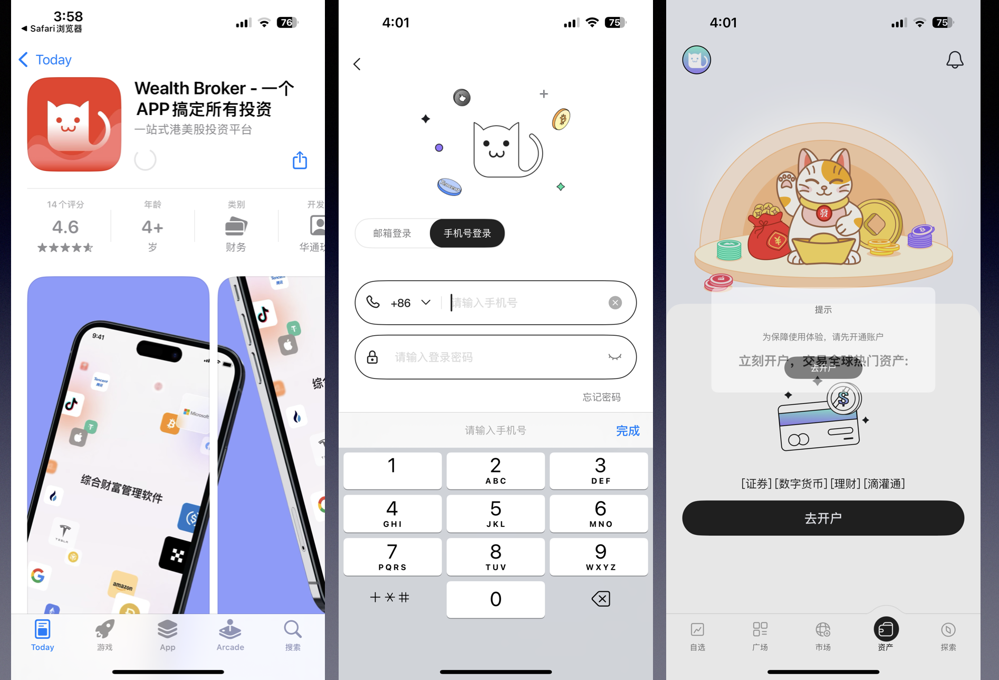
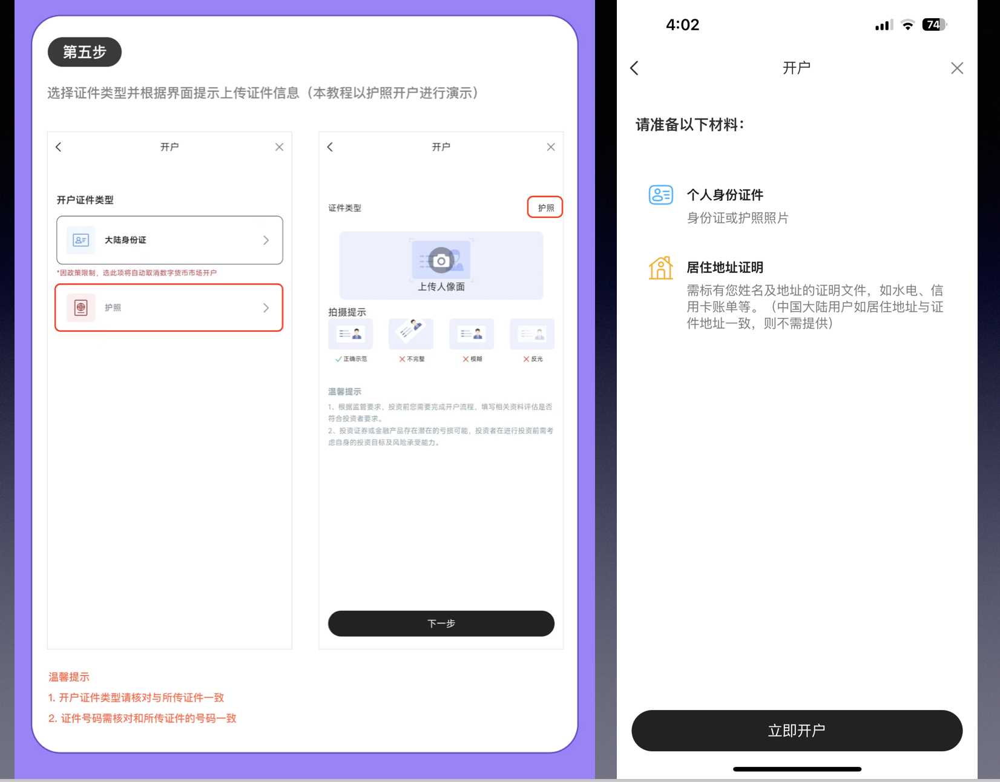
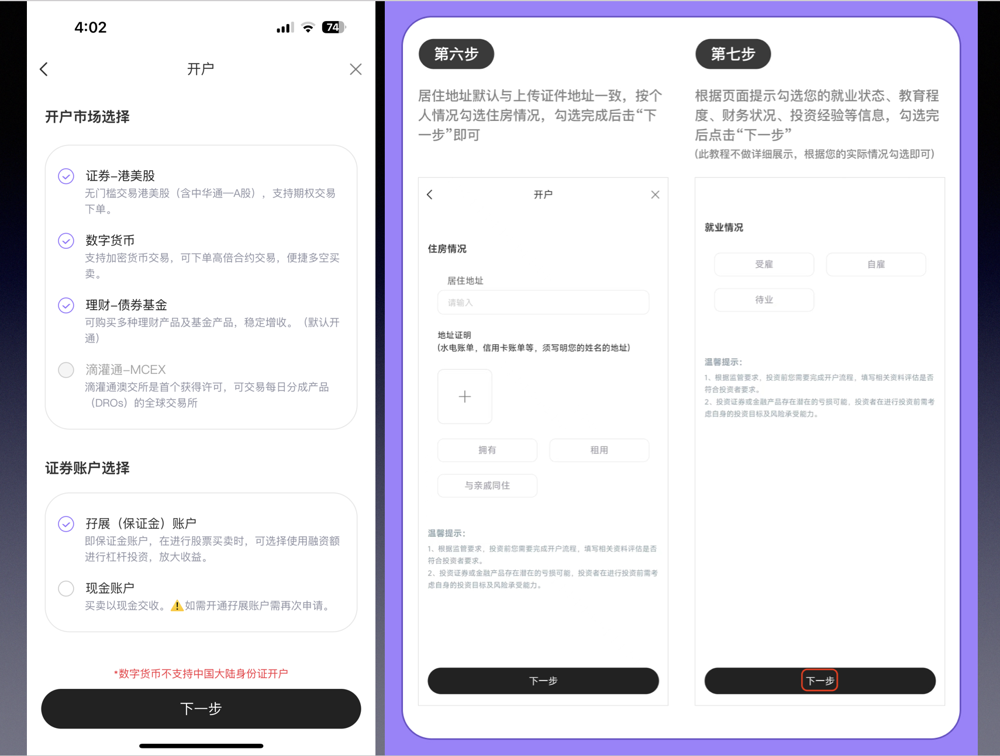
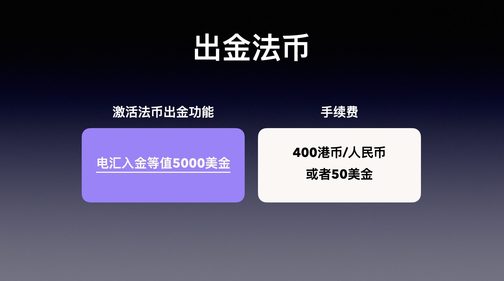
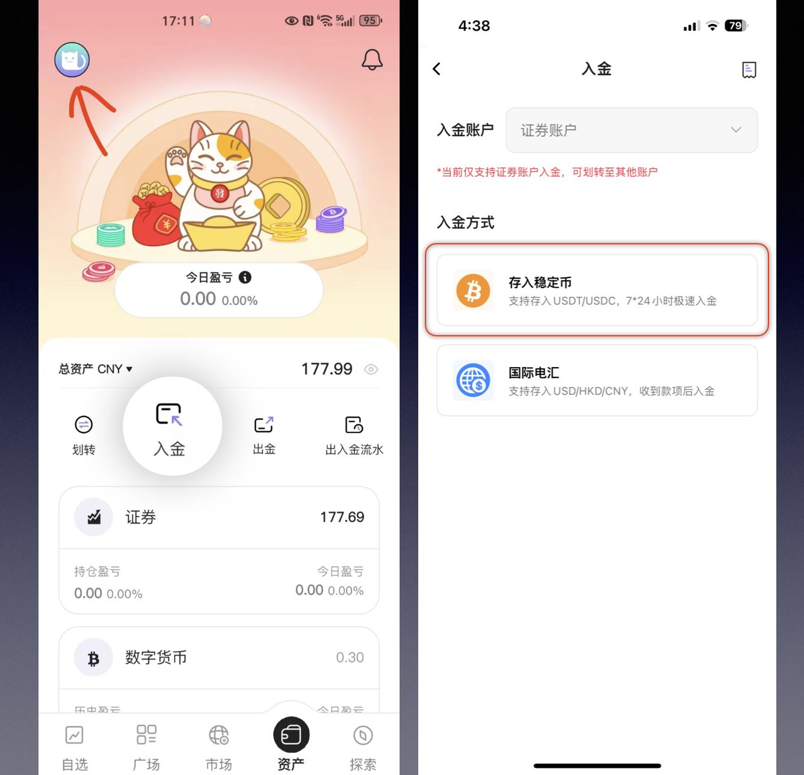
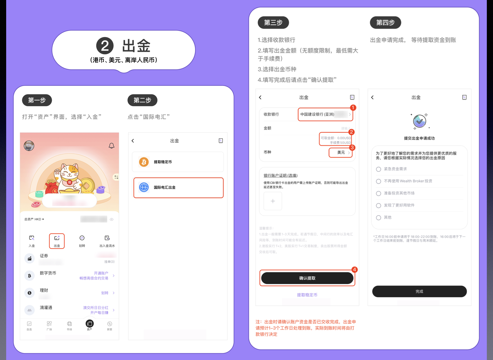

春风拂过，万物开始生长，现在真是春暖花开的好时节啊，气温回暖，到处姹紫嫣红、桃红柳绿，万物勃发，就连路边的野花也开了，一片欣欣向荣，生机勃勃的景象。在这个季节，好像一切都可以重新开始，也正因为如此才让人充满无限动力与希望。今天和大家分享支持出入U的券商，很多朋友都曾经问过我“如何提U”，今天这个方案不论从安全性和便捷性上来说应该是比较理想的，这就是今天为大家介绍的华通证券（wealth broker）。华通证券简介注意这个名字容易和华盛通混淆，这是两家公司，没什么关联，顶多算个同行。华通证券主要服务客户是机构，目前有超过20个机构客户，年交易额达数十亿港元，被Frost & Sullivan评为亚太地区最大的金融科技服务供应商之一。

# 主要优势

- 可存入稳定币（USDT/USDC），提取法币（港币/美金/离岸人民币）。
- 护照注册可申请开通数字货币交易功能。
- 无需存量证明
- 注册资料准备身份证手机号，支持86邮箱

## 注册步骤
注册步骤华通证券的注册流和开是分开的。

### 第一步：点击下面的注册链接，进行注册。https://p.wealthbr.com/xzCaHFJ?lan=zh

### 第二步 下载App开户

下载好App之后，我们用注册的手机号登录，然后点击去开户，绑定邮箱。

- 账户类型，一般选择个人，继续点击“立即开户”。
- 填写个人资料的页面我就省略了，证券账户类型我用保证金账比较多。
- 人脸认证，我提交审核后有加速，当天就通过了。
大家需要加速的话加我微信，帮大家对接官方工作人员崔审。账户开好之后就可以出入U了，充完U兑换为HKD，这对没有港卡的用户来说，就非常友好，持有U的朋友也可以，把U变成法币放进股市。

## 注意事项
未使用电汇转入的账户，不支持提取法币，只能充提U。满足以下要求就可以实现充U，提法币。电汇转入要求：最低等值5000美金电汇提取要求：账户金额留存一周以上或至少10笔交易按上面操作，就可以，要有出入的这些操作，规避下。

华通证券（W Broker）可以出入U的券商，持有香港证券和数字货币双牌照。低至70元资产就可以交易港美股，0门槛开通融资交易，50倍杠杆打新港股，数字货币也可以自由兑换交易港美股！

## 邀请注册
注册地址：https://p.wealthbr.com/xzCaHFJ?lan=zh
邀请码：GT8EW

<a href="https://mp.weixin.qq.com/s/2mNZXuRMRKVTPpmi69B7jQ" target="_blank" rel="noopener">公众号阅读</a>
