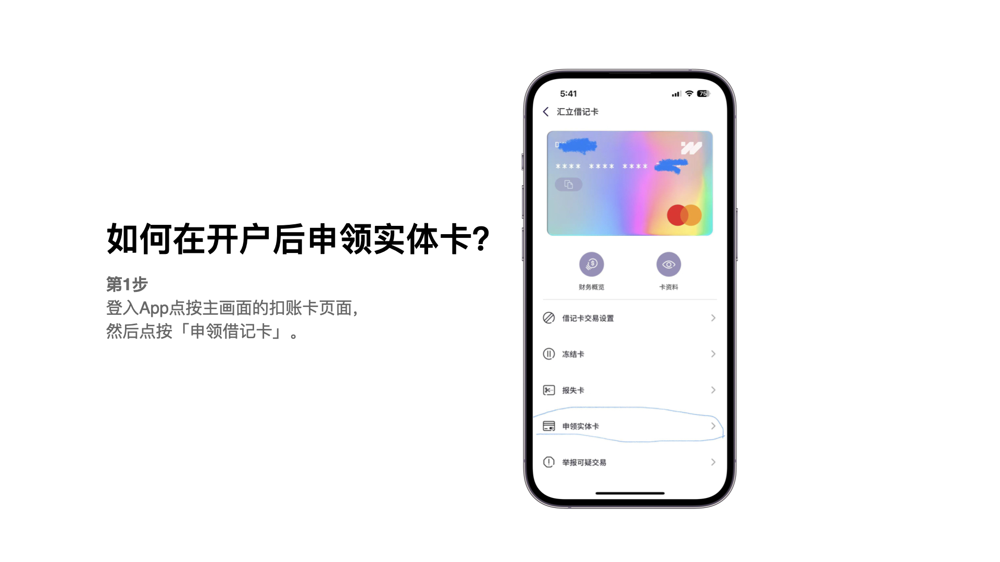
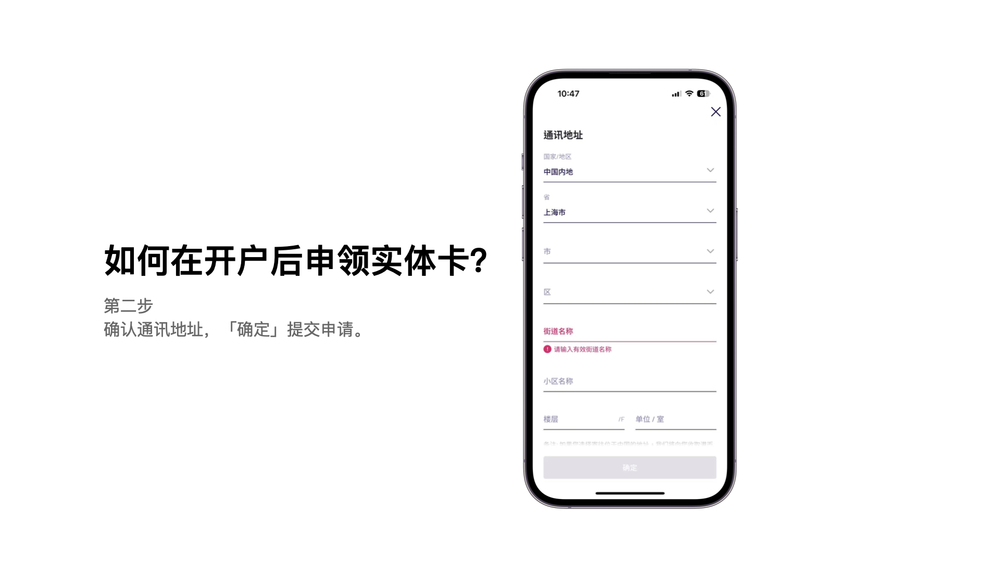

WeLab「香港汇立银行」实体卡终于在万众期待中推出了，对于实体卡，各位用户朋友都非常渴望，在我交流过的大部分用户当中，好像是说觉得银行账户就是卡号，钱就存在银行卡里。但是银行的存款是存在你的银行账户中的，在电子支付如此发达的今天，没想到大家的观念还是停留在过去。不过，如今WeLab「香港汇立银行」已经推出了实体卡，大家也就不会再有其他的担忧了吧，还有香港银行存款保障计划的保障金额也已经提高到了80万港币了。

「申请步骤」
现在大家可以在手机App中来申请了，邮费是35港币，跟官方确认过会发EMS或者顺丰。
第一步：登入App点按主画面的扣账卡页面，然后点按「申领借记卡」。
第二步：确认收件地址，确认领取实体卡。
还没有注册的朋友，在申请之前大家可以在注册的时候输入我的推荐码“LAOSJI”（最容易的记忆方式是老司机拼音，司只有S），领取开户奖励100
+200，本邀请码长期有效，但是活动奖励每隔一段时间都更新，今天是领取300奖励活动的最后一天，大家抓紧注册。

 
