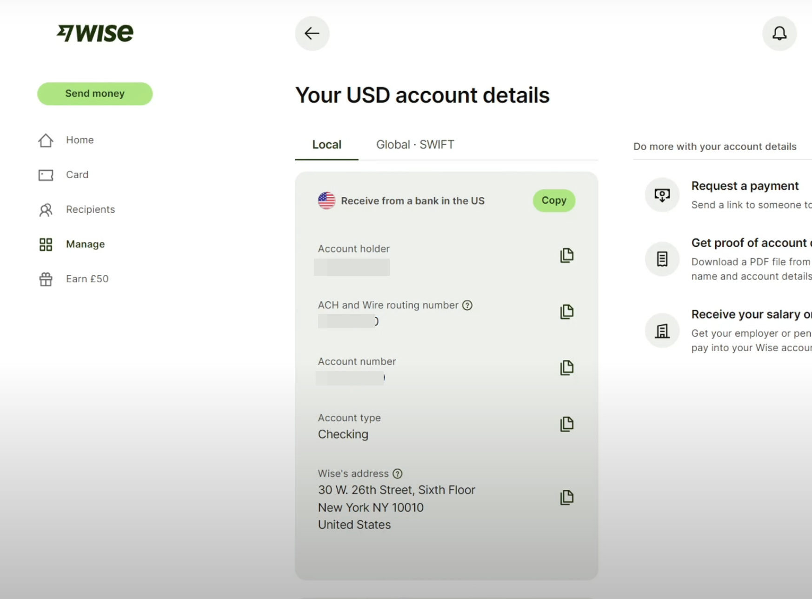
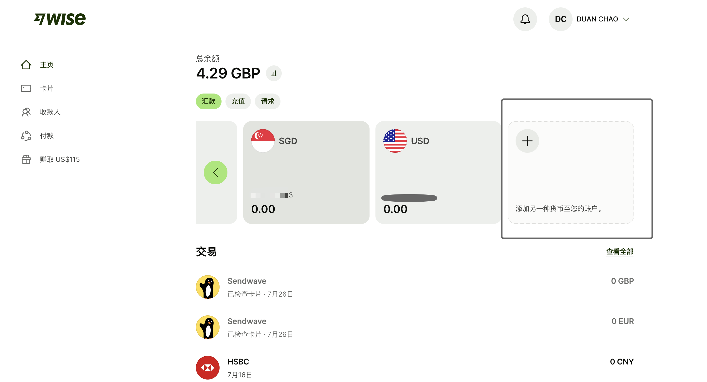
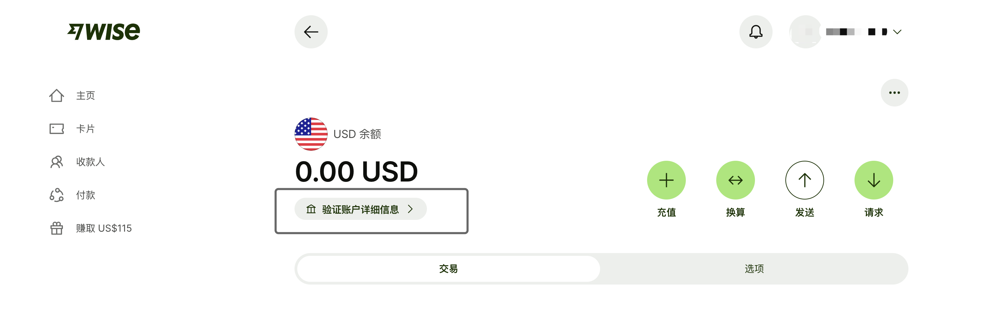
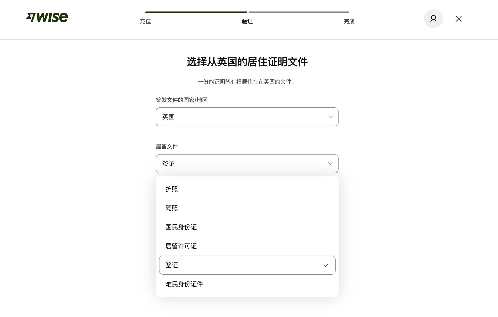

上周，为了帮留言给我的朋友去测试wise入金嘉信，特意去开了一下wise的美元账户。之前wise暂停了一段时间美国wise账户申请，现在申请美元账户需要先加入等候名单，我申请加入等候名单之后，第二天就通过了，不过需要上传地址证明和居住证明，今天来分享一下wise美元账户如何开通。

我的wise是英国的地址，用的是UKpostbox包裹地址，当时用ifast转账激活，后来之前用来给我的英国手机卡giffgaff和Vodafone充值以及验证激活其他账户，所以，目前还是正常使用状态。在我申请了美元账户之后，wise提醒我验证账户，需要上传地址证明和居住证明，如果你有美国的ITIN的话就省事多了。我用了ifast的账单做地址证明，提交之后，显然wise觉得这个证明还不够充分，继续让我提交英国政府签发的居留证明比如签证，验证通过后wise才能给美元账户，但是不影响其他币种账户的使用。

# 如何申请wise美元账户？
wise注册链接：https://wise.com/invite/dic/duanc11

## 第一步添加USD账户

登录wise账户后，在主页，点击“添加另一种货币至你的账户”，然后选择“USD”。

## 第二步验证账户详细信息

如果你没有激活的话，需要同名账户转账+上传地址证明和居留证明。我的wise账户在开通美元账户之前，从来没有跟我要过地址证明。在我申请了美元账户之后，为了验证账户我提交了ifast账单，结果仍然要求我提交英国政府签发的居留证明，我就抱着试一试的想法，提交了一个2年的英国旅游签证。

# wise国区可以申请USD账户吗？

可以，不过是商业账户（也就是公户）。账户持有人显示是Wise US Inc.，除了收款和转账之外，没啥用途。

# wise的USD账户可以用来出入金吗？

国区wise出入金是不行了，如果是英区或其他欧美地区的账户验证通过，还是可以很香的。可以从港卡或者新加坡ocbc、ifast等账户直接转账到wise，然后在wise转换成美金直接汇入嘉信，这样可以做到嘉信等美国券商无损出入金。我上周用港卡FPS入金了一笔到嘉信，估计今天才能到账，等到张之后，给大家分享嘉信如何使用港卡无损入金。

# **如何激活wise？**

如果你有港卡的话，直接通过港卡转入港币。如果没有的话，还有一个成本最低的方法就是先注册一个新加坡OCBC，然后再注册一个ifast，通过ocbc和ifast转账激活wise新币和欧元帐户，这样没有任何资金手续费损失。

还有就是国内兴业银行的寰宇人生，直接转wise也没有手续费，可以申请寰宇人生激活wise。

大部分持有U的朋友，通过瑞士杜高斯贝银行来激活wise，也是一个方法，但是杜高手续费太贵。

[免费注册一个英国通讯地址「UKPOSTBOX」：Wise英国实体卡收卡必备，接受信件、海淘转运全都能安全搞定，还能注册公司](http://mp.weixin.qq.com/s?__biz=MjM5MTM0NTgxNQ==&mid=2648636651&idx=1&sn=15e261d884dc756b494345d1d8d90ceb&chksm=be9ca11389eb28054e373f7f24a77b7b914e06fdf2c84c03d8de7f5d3006c3033b1011358986#rd)

[「英区Wise实体卡」申请+转运收卡全过程：EMS转运回国耗时8天，花费12.96英镑](http://mp.weixin.qq.com/s?__biz=MjM5MTM0NTgxNQ==&mid=2648636672&idx=1&sn=e10f4522c7b073df64c8cf547ea6db6e&chksm=be9ca0f889eb29ee4c478bb463fbe1324c0b6c90915666fb2b2972a555291901bda95688c17b#rd)

[大量Wise账户被要求提供地址证明，这份攻略请收好。](http://mp.weixin.qq.com/s?__biz=MjM5MTM0NTgxNQ==&mid=2648638188&idx=1&sn=19a5c00ce4d8545258fd3aff8a8750ab&chksm=be9d5f1489ead6021f24ec214ee7653063e1b72a641c4086dd636d8dd280ba0509bf75cc81eb#rd)

[iFast账户是什么？不出国就能开的英国银行账户，全球转账免电汇手续费，建议人手准备一个。](http://mp.weixin.qq.com/s?__biz=MjM5MTM0NTgxNQ==&mid=2648636330&idx=1&sn=9d1fac0d8ea8609dd635d22a1180e604&chksm=be9ca65289eb2f4466db03c575ea005c209678b9fbfa168c6eb7c673db189577a13dc1d77062#rd)

[我是如何拿到第一个「瑞士银行」账户的？瑞士杜高斯贝银行开户可领5DUK，](http://mp.weixin.qq.com/s?__biz=MjM5MTM0NTgxNQ==&mid=2648637089&idx=1&sn=2a65d00dcbe7c94a0b827bf3813c5ab7&chksm=be9ca35989eb2a4ffefc8729d23f7f2d9d682347210cd46bc4f9db7b9ca981bf84e7647c1c2d#rd)

[「港美股新户」天堂新加坡：手机有网就能注册，0成本拥有新加坡华侨银行（OCBC）账户](http://mp.weixin.qq.com/s?__biz=MjM5MTM0NTgxNQ==&mid=2648636896&idx=1&sn=7df56c73e8531f81108a0b032e7d9896&chksm=be9ca01889eb290e535beceff13ddcde6f9a19e555948d68c11140479c17a38a7546c1b8c290#rd)